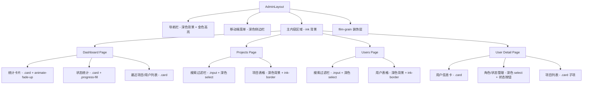

# 设计文档：管理系统电影工业风格重设计

## 概述

将管理系统（/admin）的所有页面从传统白色后台风格迁移到主站的电影工业奢华风格设计系统。核心策略是复用 `globals.css` 中已定义的 CSS 变量和工具类，替换所有 Tailwind 灰色系硬编码样式，同时保留所有现有业务逻辑和功能不变。

设计方针：
- 用 CSS 变量（`--ink`、`--gold`、`--text-primary` 等）替换所有硬编码颜色
- 用设计系统类（`.card`、`.btn-primary`、`.input`、`.tag` 等）替换自定义样式
- 添加动画效果（`animate-fade-up`、`animate-fade-in`）和装饰元素（`.film-grain`、`.glow`）
- 集成 i18n 国际化支持
- 保持所有 CRUD 操作、权限检查、过滤逻辑不变

## 架构



## 组件与接口

### AdminLayout 组件改造

当前状态：白色背景（`bg-gray-50`）+ 黄色导航栏（`bg-yellow-400`）

目标状态：
- 外层容器：`min-h-screen bg-[var(--ink)]`
- 导航栏：`bg-[var(--ink)]/95 backdrop-blur-md border-b border-[var(--ink-border)]`（与主站 HeaderSimple 一致）
- Logo 区域：使用 `--font-display` 字体，金色文字
- 菜单项：使用 `nav-link` 类，活跃状态使用 `--gold` 底部边框
- 移动端菜单：`bg-[var(--ink-lighter)]` 背景，金色活跃指示器
- 添加 `.film-grain` 装饰层
- 添加 `.glow` 光晕装饰在导航区域
- 集成 `useTranslation` hook

导航栏结构参考主站 `HeaderSimple.tsx` 的设计模式：
```tsx
<nav className="sticky top-0 z-50 bg-[var(--ink)]/95 backdrop-blur-md border-b border-[var(--ink-border)]">
  <div className="container">
    <div className="h-16 flex items-center justify-between">
      {/* Logo + 菜单项 + 返回首页 */}
    </div>
  </div>
</nav>
```

### Dashboard 页面改造

统计卡片样式映射：
| 当前样式 | 目标样式 |
|---------|---------|
| `bg-white shadow rounded-lg` | `card` 类 |
| `text-gray-500` | `text-[var(--text-secondary)]` |
| `text-gray-900` | `text-[var(--text-primary)]` |
| `text-green-600` | `text-[var(--success)]` |
| `text-yellow-600` | `text-[var(--gold)]` |
| `bg-green-100 text-green-800` | `.tag` + 自定义成功色 |
| `bg-blue-100 text-blue-800` | `.tag` + 自定义蓝色 |

统计卡片添加 `animate-fade-up` + `delay-N` 实现交错动画。

最近项目/用户列表：
- 容器使用 `.card` 类
- 列表项使用 `border-b border-[var(--ink-border)]` 分隔
- 悬停效果：`hover:bg-[var(--ink-lighter)]`
- 底部链接使用金色文字

### Projects 页面改造

过滤栏：
- 搜索输入框：使用 `.input` 类
- 下拉选择框：`bg-[var(--ink-lighter)] border border-[var(--ink-border)] text-[var(--text-primary)]`，聚焦时 `border-[var(--gold)]`
- 过滤栏容器：`.card` 类 + `p-4`

表格样式：
- 表头：`bg-[var(--ink-lighter)]`，文字 `text-[var(--text-muted)]`
- 表体：`bg-[var(--ink-light)]`
- 行分隔：`border-[var(--ink-border)]`
- 悬停：`hover:bg-[var(--ink-lighter)]`
- 操作链接：查看/编辑用 `text-[var(--gold)]`，删除用 `text-[var(--error)]`

移动端响应式：表格在小屏幕下转为卡片布局。

### Users 页面改造

与 Projects 页面采用相同的表格和过滤栏样式策略。

状态徽章样式：
- 活跃：`bg-[rgba(74,222,128,0.15)] text-[var(--success)]`
- 已禁用：`bg-[rgba(248,113,113,0.15)] text-[var(--error)]`

角色选择器：与过滤栏下拉框使用相同的深色样式。

### User Detail 页面改造

- 用户信息容器：`.card` 类
- 头像区域：保持圆形，添加金色边框 `border-2 border-[var(--gold-muted)]`
- 用户名：`--font-display` 字体
- 角色选择器：深色背景 + 金色聚焦边框
- 状态切换按钮：使用 `--success`/`--error` 颜色 + 深色背景
- 项目列表项：`bg-[var(--ink-lighter)] rounded-[var(--radius-lg)]` + 悬停效果
- 返回链接：`text-[var(--gold)]`

### i18n 集成

在 `i18n.ts` 中添加管理系统相关的翻译键：

```typescript
// 需要添加的翻译键（中英文）
admin: {
  systemTitle: '蜂巢管理系统' / 'Beehive Admin',
  dashboard: '数据统计' / 'Dashboard',
  projectManagement: '项目管理' / 'Project Management',
  userManagement: '用户管理' / 'User Management',
  backToHome: '返回首页' / 'Back to Home',
  totalProjects: '总项目数' / 'Total Projects',
  activeProjects: '活跃项目' / 'Active Projects',
  totalUsers: '总用户数' / 'Total Users',
  totalParticipants: '总参与人数' / 'Total Participants',
  completedProjects: '已完成项目' / 'Completed Projects',
  pausedProjects: '已暂停项目' / 'Paused Projects',
  totalDuration: '总时长' / 'Total Duration',
  recentProjects: '最近创建的项目' / 'Recent Projects',
  recentUsers: '最近注册的用户' / 'Recent Users',
  // ... 更多键值
}
```

## 数据模型

本次重设计不涉及数据模型变更。所有现有的 `Project`、`User` 类型和 `projectStorage`、`userStorage` 接口保持不变。

## 正确性属性

*正确性属性是一种在系统所有有效执行中都应成立的特征或行为——本质上是关于系统应该做什么的形式化陈述。属性作为人类可读规范和机器可验证正确性保证之间的桥梁。*

本次重设计主要是视觉样式迁移，大部分验收标准涉及 CSS 类和颜色变量的使用，不适合自动化属性测试。以下是可测试的功能性属性：

Property 1: 仪表盘统计计算正确性
*For any* 项目集合和用户集合，仪表盘计算的统计数据（总项目数、活跃项目数、已完成项目数、已暂停项目数、总用户数、活跃用户数、总参与人数）应与按状态过滤后的计数完全一致。
**Validates: Requirements 2.9**

Property 2: 项目过滤功能正确性
*For any* 项目集合和任意搜索查询/状态过滤/分类过滤组合，过滤结果应仅包含同时满足所有过滤条件的项目（标题/描述/创建者包含搜索词，且状态匹配，且分类匹配）。
**Validates: Requirements 3.7**

Property 3: 用户过滤功能正确性
*For any* 用户集合和任意搜索查询/角色过滤/状态过滤组合，过滤结果应仅包含同时满足所有过滤条件的用户（用户名/邮箱包含搜索词，且角色匹配，且状态匹配）。
**Validates: Requirements 4.7**

Property 4: i18n 翻译键完整性
*For any* 翻译键存在于英文资源中，该键也应存在于中文资源中，反之亦然。所有管理系统新增的翻译键在两种语言中都应有对应值。
**Validates: Requirements 6.6**

## 错误处理

- 权限检查逻辑保持不变：未登录或非管理员用户重定向到首页
- 加载状态使用深色背景 + `--text-secondary` 颜色的加载提示，替换当前的灰色加载提示
- 数据加载失败时的 Toast 提示保持不变，仅样式跟随设计系统
- 用户详情页找不到用户时的重定向逻辑保持不变
- 删除确认逻辑保持不变

## 测试策略

由于本次重设计主要是视觉样式迁移，测试重点在于：

**单元测试**：
- 验证统计计算逻辑在重构后仍然正确
- 验证过滤逻辑在重构后仍然正确
- 验证 CRUD 操作（删除、状态切换、角色变更）在重构后仍然正常
- 验证 i18n 翻译键的完整性

**属性测试**：
- 使用 `fast-check` 库进行属性测试
- 每个属性测试至少运行 100 次迭代
- 每个测试用注释标注对应的设计文档属性编号
- 标注格式：**Feature: admin-redesign, Property {number}: {property_text}**

**手动验证**：
- 视觉一致性需要人工对比主站和管理系统的样式
- 响应式布局需要在不同设备尺寸下手动验证
- 动画效果需要人工确认流畅度和时序

