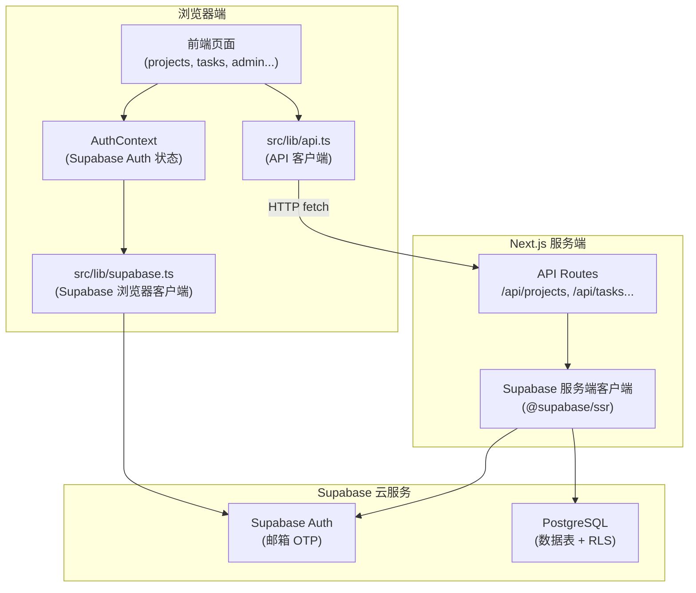
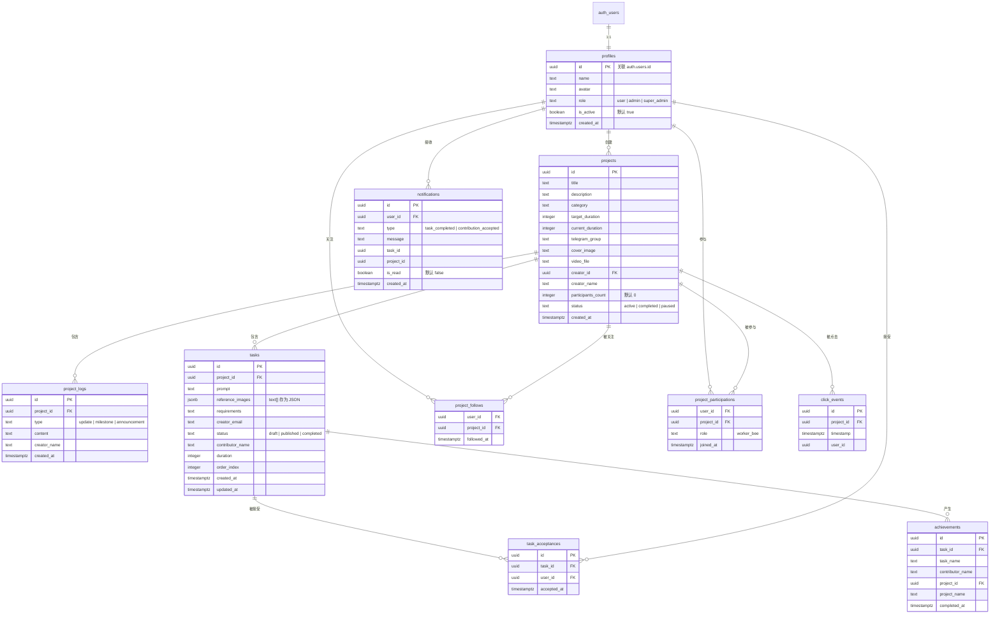

# 设计文档：后端 Supabase 迁移

## 概述

本设计将蜂巢AI视频协作平台从纯前端 localStorage 架构迁移到 Supabase BaaS 后端架构。核心变更包括：

1. 使用 Supabase PostgreSQL 数据库替代 localStorage 存储
2. 使用 Supabase Auth 邮箱 OTP 替代前端 bcryptjs 密码认证
3. 通过 Next.js API Routes 作为中间层封装数据库操作
4. 创建新的 `src/lib/api.ts` 替代 `src/lib/storage.ts`，保持接口兼容

迁移策略采用"接口兼容替换"模式：新的 API 客户端导出与 storage.ts 完全相同的模块名和方法签名，返回相同的 `StorageResult<T>` 类型，使前端页面只需更改 import 路径即可完成切换。

## 架构



### 数据流

1. 认证流：浏览器 → Supabase Auth（直连，OTP 发送/验证）
2. 数据读写流：浏览器 → API Routes → Supabase DB（通过服务端客户端，继承 RLS）
3. 会话管理：Supabase Auth 自动管理 JWT token 刷新，存储在 cookie 中

## 组件与接口

### 1. Supabase 客户端模块 (`src/lib/supabase.ts`)

```typescript
import { createBrowserClient } from '@supabase/ssr';

// 浏览器端客户端（用于 Auth 操作）
export function createClient() {
  return createBrowserClient(
    process.env.NEXT_PUBLIC_SUPABASE_URL!,
    process.env.NEXT_PUBLIC_SUPABASE_ANON_KEY!
  );
}
```

### 2. 服务端 Supabase 客户端 (`src/lib/supabase-server.ts`)

```typescript
import { createServerClient } from '@supabase/ssr';
import { cookies } from 'next/headers';

// 服务端客户端（用于 API Routes，继承用户 RLS 权限）
export async function createServerSupabaseClient() {
  const cookieStore = await cookies();
  return createServerClient(
    process.env.NEXT_PUBLIC_SUPABASE_URL!,
    process.env.NEXT_PUBLIC_SUPABASE_ANON_KEY!,
    {
      cookies: {
        getAll() { return cookieStore.getAll(); },
        setAll(cookiesToSet) {
          cookiesToSet.forEach(({ name, value, options }) =>
            cookieStore.set(name, value, options)
          );
        },
      },
    }
  );
}
```

### 3. API Routes 结构

```
src/app/api/
├── auth/
│   └── profile/route.ts          # GET/PUT 用户 profile
├── projects/
│   ├── route.ts                   # GET 列表 / POST 创建
│   └── [id]/
│       ├── route.ts               # GET/PUT/DELETE 单个项目
│       └── logs/route.ts          # GET/POST 项目日志
├── tasks/
│   ├── route.ts                   # GET 所有已发布任务
│   └── [projectId]/
│       └── route.ts               # GET/POST/PUT/DELETE 项目任务
├── task-acceptances/
│   └── route.ts                   # POST 接受任务 / GET 查询
├── notifications/
│   └── route.ts                   # GET/POST/PUT 通知
├── achievements/
│   └── route.ts                   # GET/POST 成就
├── project-follows/
│   └── route.ts                   # POST 关注 / DELETE 取消关注
├── project-participations/
│   └── route.ts                   # POST 参与
└── click-events/
    └── route.ts                   # POST 记录 / GET 统计
```

### 4. API 响应格式

所有 API 端点统一返回格式，与现有 `StorageResult<T>` 兼容：

```typescript
// 成功响应
{ success: true, data: T }

// 错误响应
{ success: false, error: string }
```

### 5. API 客户端模块 (`src/lib/api.ts`)

保持与 `storage.ts` 完全相同的导出接口：

```typescript
// 内部 fetch 封装
async function apiFetch<T>(url: string, options?: RequestInit): Promise<StorageResult<T>> {
  try {
    const res = await fetch(url, {
      ...options,
      headers: { 'Content-Type': 'application/json', ...options?.headers },
    });
    const body = await res.json();
    if (res.status === 401) {
      // 触发登出
      window.location.href = '/auth/login';
      return { success: false, error: '登录已过期，请重新登录' };
    }
    return body;
  } catch {
    return { success: false, error: '网络请求失败，请检查网络连接' };
  }
}

export const userStorage = {
  async getCurrentUser(): Promise<StorageResult<User | null>> { ... },
  // ... 其他方法
};

export const projectStorage = { ... };
export const projectRelationStorage = { ... };
export const taskStorage = { ... };
export const taskAcceptanceStorage = { ... };
export const notificationStorage = { ... };
export const achievementStorage = { ... };
export const clickTracker = { ... };
```

### 6. AuthContext 迁移 (`src/contexts/AuthContext.tsx`)

```typescript
// 关键变更：
// 1. 初始化时使用 supabase.auth.getSession() 替代 localStorage
// 2. 监听 onAuthStateChange 自动更新状态
// 3. login 方法改为接受 email + OTP token
// 4. 用户信息从 profiles 表获取

interface AuthContextValue {
  user: User | null;          // 从 profiles 表获取
  isLoggedIn: boolean;
  loading: boolean;
  isAdminUser: boolean;
  sendOtp: (email: string) => Promise<void>;     // 新增：发送 OTP
  verifyOtp: (email: string, token: string) => Promise<void>; // 新增：验证 OTP
  logout: () => Promise<void>;                    // 改为 async
  updateUser: (data: Partial<User>) => Promise<void>; // 改为 async
  isProjectOwner: (projectId: string) => Promise<boolean>; // 改为 async
}
```

## 数据模型

### 数据库 ER 图



### SQL Schema 关键设计决策

1. **profiles 表**：使用 `auth.users.id` 作为主键，通过触发器在用户注册时自动创建
2. **tasks.reference_images**：使用 `jsonb` 类型存储 base64 图片数组（原 `string[]`）
3. **tasks.order_index**：字段名避免使用 PostgreSQL 保留字 `order`
4. **project_follows / project_participations**：使用 `(user_id, project_id)` 复合主键
5. **task_acceptances**：使用 `(task_id, user_id)` 唯一约束防止重复接受
6. **click_events**：使用 `(project_id, timestamp)` 复合索引优化时间窗口查询
7. **所有 ID 字段**：使用 `uuid` 类型，由 `gen_random_uuid()` 自动生成

### RLS 策略设计

```sql
-- profiles 表：用户只能读写自己的 profile，管理员可读写所有
-- projects 表：所有人可读，创建者可写，管理员可写所有
-- tasks 表：所有人可读，项目创建者可写
-- notifications 表：用户只能读写自己的通知
-- 管理员判断：通过 profiles.role 字段查询
```

管理员权限通过数据库函数实现：

```sql
CREATE OR REPLACE FUNCTION is_admin()
RETURNS boolean AS $$
  SELECT EXISTS (
    SELECT 1 FROM profiles
    WHERE id = auth.uid()
    AND role IN ('admin', 'super_admin')
  );
$$ LANGUAGE sql SECURITY DEFINER;
```


## 正确性属性

*正确性属性是一种在系统所有有效执行中都应成立的特征或行为——本质上是关于系统应该做什么的形式化陈述。属性作为人类可读规范和机器可验证正确性保证之间的桥梁。*

### Property 1: 关系表唯一约束

*For any* user_id 和 project_id（或 task_id 和 user_id）组合，对 project_follows、project_participations 或 task_acceptances 表插入重复记录时，数据库应拒绝插入并返回约束冲突错误。

**Validates: Requirements 1.5**

### Property 2: 未认证用户数据访问限制

*For any* 未认证的数据库查询，只能读取 projects 表、status 为 'published' 的 tasks 记录和 achievements 表的数据，对其他表的读取和所有表的写操作都应被 RLS 拒绝。

**Validates: Requirements 2.2**

### Property 3: 资源所有者 Profile 隔离

*For any* 两个不同的认证用户 A 和 B，用户 A 通过 RLS 查询 profiles 表时只能获取自己的记录，无法读取或修改用户 B 的 profile。

**Validates: Requirements 2.3**

### Property 4: 项目创建者写权限

*For any* 项目和任意认证用户，只有 creator_id 等于该用户 id 的项目才能被该用户更新或删除，其他用户的更新/删除操作应被 RLS 拒绝。

**Validates: Requirements 2.4**

### Property 5: 任务权限继承项目创建者

*For any* 任务和任意认证用户，只有该任务所属项目的 creator_id 等于该用户 id 时，该用户才能创建、更新或删除该任务。

**Validates: Requirements 2.5**

### Property 6: 通知所有者隔离

*For any* 通知记录和任意认证用户，只有 user_id 等于该用户 id 的通知才能被该用户读取和更新。

**Validates: Requirements 2.6**

### Property 7: 管理员全表 CRUD 权限

*For any* role 为 'admin' 或 'super_admin' 的用户，对所有数据表的 CRUD 操作都应成功执行，不受普通用户的 RLS 限制。

**Validates: Requirements 2.7**

### Property 8: 首次登录自动创建 Profile

*For any* 新邮箱地址，首次通过 OTP 验证登录后，profiles 表中应存在一条 id 等于 auth.uid() 的记录，且 name 字段为邮箱 @ 前的部分，role 为 'user'。

**Validates: Requirements 3.3**

### Property 9: 错误 OTP 验证失败

*For any* 邮箱地址和任意不正确的 OTP 值，调用 verifyOtp 应返回失败结果并包含错误提示信息。

**Validates: Requirements 3.4**

### Property 10: Session 生命周期 Round-Trip

*For any* 已通过 OTP 验证的用户，登出后 session 应被清除；对于任意有效 session，页面重新加载后应自动恢复用户登录状态。

**Validates: Requirements 3.6, 3.7**

### Property 11: 无效 Session 返回 401

*For any* 缺少有效 Session 或携带过期 token 的 API 请求，访问受保护资源时 API_Layer 应返回 HTTP 401 状态码。

**Validates: Requirements 4.3**

### Property 12: API 响应格式一致性

*For any* API 请求，成功时响应体格式为 `{ success: true, data: T }`，失败时响应体格式为 `{ success: false, error: string }` 并附带适当的 HTTP 状态码。

**Validates: Requirements 4.4, 4.5**

### Property 13: 写操作必填字段验证

*For any* 缺少必填字段的 POST/PUT 请求，API_Layer 应返回 400 状态码和描述缺失字段的错误信息。

**Validates: Requirements 4.6**

### Property 14: 任务数量上限

*For any* 已有 10 个任务的项目，尝试创建第 11 个任务时 API_Layer 应返回错误并拒绝创建。

**Validates: Requirements 4.7**

### Property 15: API 客户端返回 StorageResult 格式

*For any* API_Client 方法调用，返回值结构应符合 `StorageResult<T>`（包含 success 布尔值，成功时有 data 字段，失败时有 error 字段）。

**Validates: Requirements 5.2**

### Property 16: 网络失败错误处理

*For any* 网络请求失败（超时、断网等），API_Client 应返回 `{ success: false, error: '网络请求失败，请检查网络连接' }`。

**Validates: Requirements 5.4**

### Property 17: 401 自动登出

*For any* API 返回 401 状态码的响应，API_Client 应触发用户登出流程并重定向到登录页面。

**Validates: Requirements 5.5**

### Property 18: Auth 状态变化同步

*For any* Supabase Auth 状态变化事件（SIGNED_IN、SIGNED_OUT、TOKEN_REFRESHED），AuthContext 的 React 状态应在事件触发后同步更新。

**Validates: Requirements 6.2**

### Property 19: 用户信息更新 Round-Trip

*For any* 用户 profile 更新操作（如修改 name 或 avatar），通过 updateUser 方法更新后，重新获取该用户的 profile 应返回更新后的值。

**Validates: Requirements 6.5**

### Property 20: isProjectOwner 一致性

*For any* 项目和用户，isProjectOwner 方法的返回值应与数据库中该项目的 creator_id 是否等于该用户 id 一致。

**Validates: Requirements 6.6**

### Property 21: 项目 CRUD Round-Trip

*For any* 有效的项目数据，通过 API 创建项目后查询应返回相同数据；更新后查询应返回更新后的数据；删除后查询应返回不存在。

**Validates: Requirements 7.3**

### Property 22: 关系操作 Round-Trip

*For any* 用户和项目，执行关注操作后查询 isFollowing 应返回 true；取消关注后应返回 false。参与操作同理。

**Validates: Requirements 7.5**

### Property 23: 管理后台权限控制

*For any* role 为 'user' 的普通用户，访问管理后台 API 端点（如获取所有用户列表）应被拒绝并返回 403 状态码。

**Validates: Requirements 7.6**

### Property 24: 环境变量缺失错误提示

*For any* 必需的环境变量（NEXT_PUBLIC_SUPABASE_URL、NEXT_PUBLIC_SUPABASE_ANON_KEY）缺失时，Supabase 客户端初始化应输出明确的错误日志。

**Validates: Requirements 8.3**

## 错误处理

### 网络层错误

| 错误场景 | 处理方式 |
|---------|---------|
| 网络断开/超时 | API_Client 返回 `{ success: false, error: '网络请求失败，请检查网络连接' }` |
| HTTP 401 | API_Client 触发登出，重定向到 `/auth/login` |
| HTTP 403 | API_Client 返回 `{ success: false, error: '没有权限执行此操作' }` |
| HTTP 404 | API_Client 返回 `{ success: false, error: '请求的资源不存在' }` |
| HTTP 500 | API_Client 返回 `{ success: false, error: '服务器内部错误，请稍后重试' }` |

### 认证层错误

| 错误场景 | 处理方式 |
|---------|---------|
| OTP 发送失败 | 显示 "验证码发送失败，请稍后重试" |
| OTP 验证失败 | 显示 "验证码错误，请重新输入" |
| OTP 过期 | 显示 "验证码已过期，请重新获取" |
| Session 过期 | 自动尝试 refresh，失败则登出 |
| Supabase 服务不可用 | 显示 "服务暂时不可用，请稍后重试" 并提供重试按钮 |

### 数据层错误

| 错误场景 | 处理方式 |
|---------|---------|
| 唯一约束冲突 | 返回具体的业务错误信息（如 "已经关注过该项目"） |
| 外键约束失败 | 返回 "关联数据不存在" |
| 字段验证失败 | 返回具体的字段验证错误信息 |
| 任务数量超限 | 返回 "每个项目最多只能创建 10 个任务" |

## 测试策略

### 测试框架选择

- **单元测试 + 属性测试**: 使用 Playwright Test（项目已配置）
- **属性测试库**: 使用 `fast-check` 进行属性测试
- **API 测试**: 使用 Playwright 的 `request` API 进行 API 端点测试

### 双重测试方法

**单元测试**（具体示例和边界情况）：
- 验证 SQL schema 包含所有必需表和字段
- 验证 API 端点路由存在
- 验证环境变量配置
- 验证 OTP 发送/验证的具体流程
- 验证 AuthContext 接口兼容性

**属性测试**（通用属性，最少 100 次迭代）：
- RLS 权限隔离属性（Property 2-7）
- API 响应格式一致性（Property 12）
- Round-trip 属性（Property 10, 19, 21, 22）
- 错误处理属性（Property 9, 11, 13, 16, 17）
- 业务规则属性（Property 1, 8, 14, 23, 24）

### 属性测试标注格式

每个属性测试必须包含注释引用设计文档中的属性编号：

```typescript
// Feature: backend-supabase-migration, Property 1: 关系表唯一约束
test.prop('duplicate relation insert should be rejected', [arbUserId, arbProjectId], 
  async (userId, projectId) => {
    // ... 测试实现
  }
);
```

### 测试优先级

1. **P0 - 认证安全**: RLS 策略、Session 管理、权限控制
2. **P1 - 数据完整性**: Round-trip 属性、唯一约束、外键约束
3. **P2 - API 行为**: 响应格式、错误处理、字段验证
4. **P3 - 前端集成**: AuthContext 兼容性、API 客户端行为