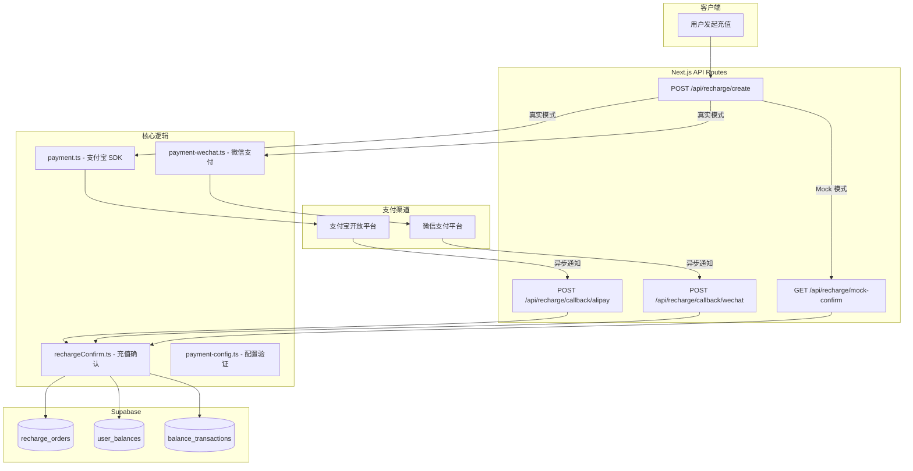

# 设计文档：支付系统上线（Payment Go-Live）

## 概述

本设计文档描述蜂巢AI视频协作平台支付系统从模拟模式切换到真实支付的技术方案。当前系统已具备完整的支付宝（PC/WAP）和微信（Native 扫码）对接代码，回调路由也已实现。核心工作集中在：环境变量配置规范化、回调验证逻辑加固、充值确认原子性改造、遗留依赖清理和数据库 Schema 优化。

技术栈：Next.js (App Router) + Supabase + alipay-sdk + 微信支付 V3 API（自建对接）

## 架构



## 组件和接口

### 1. 支付配置验证模块（新增）

**文件**: `src/lib/payment-config.ts`

```typescript
interface PaymentConfigStatus {
  alipayEnabled: boolean;
  wxPayEnabled: boolean;
  mockMode: boolean;
  missingVars: string[];
}

// 检查并报告支付配置状态
function validatePaymentConfig(): PaymentConfigStatus;

// 在应用启动时调用，记录配置状态日志
function logPaymentConfigStatus(): void;
```

该模块整合 `isAlipayEnabled()` 和 `isWxPayEnabled()` 的逻辑，提供统一的配置检查入口，并在缺少必需变量时输出明确的警告日志。

### 2. 支付宝回调路由（加固）

**文件**: `src/app/api/recharge/callback/alipay/route.ts`

现有实现已包含签名验证、金额校验和幂等处理。加固内容：
- 增加结构化日志（订单号、金额、渠道、处理结果、时间戳）
- 错误响应中不暴露内部细节

### 3. 微信支付回调路由（加固）

**文件**: `src/app/api/recharge/callback/wechat/route.ts`

现有实现已包含解密和金额校验。加固内容：
- 实现微信平台证书验证（当前代码注释标注为"简化"）
- 增加结构化日志
- 错误响应中不暴露内部细节

### 4. 充值确认逻辑（原子性改造）

**文件**: `src/lib/rechargeConfirm.ts`

当前实现分三步执行（更新订单、插入流水、更新余额），非原子操作。改造为使用 Supabase RPC 调用 PostgreSQL 函数，在单个事务中完成全部操作。

```typescript
// 新增 PostgreSQL 函数
function confirm_recharge_order(
  p_order_id: uuid,
  p_trade_no: text,
  p_expected_amount: integer
): { success: boolean; new_balance: integer; error_msg: text };
```

### 5. 环境变量示例文件（新增）

**文件**: `beehive-platform/.env.example`

列出所有支付相关环境变量及说明，供部署参考。

### 6. 数据库迁移（新增）

**文件**: `supabase/migrations/008_payment_go_live.sql`

- 将 `pingpp_charge_id` 重命名为 `external_trade_no`
- 收紧 `payment_channel` 约束，仅保留 `mock`、`alipay_pc`、`alipay_wap`、`wx_native`
- 创建原子充值确认函数 `confirm_recharge_order`

## 数据模型

### recharge_orders 表（变更后）

| 列名 | 类型 | 说明 |
|------|------|------|
| id | uuid | 主键 |
| user_id | uuid | 用户 ID |
| amount_cents | integer | 充值金额（分） |
| status | text | 订单状态：pending / paid / failed |
| payment_channel | text | 支付渠道：mock / alipay_pc / alipay_wap / wx_native |
| out_trade_no | text | 平台生成的订单号 |
| trade_no | text | 支付渠道返回的交易号（旧字段，保留兼容） |
| external_trade_no | text | 外部交易号（原 pingpp_charge_id，重命名） |
| created_at | timestamptz | 创建时间 |
| paid_at | timestamptz | 支付时间 |

### 环境变量清单

| 变量名 | 必需 | 说明 |
|--------|------|------|
| USE_MOCK_PAYMENT | 否 | 设为 `true` 强制使用模拟支付 |
| ALIPAY_APP_ID | 支付宝必需 | 支付宝应用 ID |
| ALIPAY_PRIVATE_KEY | 支付宝必需（二选一） | 支付宝应用私钥内容 |
| ALIPAY_PRIVATE_KEY_PATH | 支付宝必需（二选一） | 支付宝应用私钥文件路径 |
| ALIPAY_PUBLIC_KEY | 支付宝推荐 | 支付宝公钥内容 |
| ALIPAY_PUBLIC_KEY_PATH | 支付宝推荐（二选一） | 支付宝公钥文件路径 |
| WXPAY_APP_ID | 微信必需 | 微信支付应用 ID |
| WXPAY_MCHID | 微信必需 | 微信支付商户号 |
| WXPAY_API_KEY | 微信必需 | 微信支付 API v3 密钥 |
| WXPAY_PRIVATE_KEY | 微信必需（二选一） | 微信支付商户私钥内容 |
| WXPAY_PRIVATE_KEY_PATH | 微信必需（二选一） | 微信支付商户私钥文件路径 |
| NEXT_PUBLIC_APP_URL | 必需 | 应用基础 URL，用于构建回调地址 |


## 正确性属性

*正确性属性是一种在系统所有有效执行中都应成立的特征或行为——本质上是关于系统应该做什么的形式化陈述。属性是人类可读规范与机器可验证正确性保证之间的桥梁。*

### Property 1: 配置检查完整性

*For any* 环境变量组合（支付宝和微信支付变量的任意存在/缺失组合），`validatePaymentConfig()` 返回的 `missingVars` 应精确包含所有缺失的必需变量，且 `alipayEnabled` / `wxPayEnabled` 的值应与对应变量是否齐全一致。

**Validates: Requirements 1.1, 1.2, 1.5**

### Property 2: 支付模式选择正确性

*For any* `USE_MOCK_PAYMENT` 值（true/false/未设置）和支付密钥配置组合，系统选择的支付模式应满足：当 `USE_MOCK_PAYMENT=true` 时使用 mock；当密钥未配置时回退到 mock；当 `USE_MOCK_PAYMENT` 非 true 且密钥已配置时使用真实渠道。且 API 响应中的 `payment_channel` 字段应准确反映实际使用的渠道。

**Validates: Requirements 1.3, 5.1, 5.2, 5.3, 5.4**

### Property 3: 支付宝回调签名验证

*For any* 支付宝异步通知数据，当签名有效且 `trade_status` 为 `TRADE_SUCCESS` 或 `TRADE_FINISHED` 时，回调路由应触发充值确认；当签名无效时，应返回 `fail` 且不触发任何状态变更。

**Validates: Requirements 2.1, 2.2, 2.4**

### Property 4: 微信支付回调解密验证

*For any* 微信支付异步通知数据，当签名有效且 `event_type` 为 `TRANSACTION.SUCCESS` 时，回调路由应成功解密 resource 数据并触发充值确认；当签名无效或解密失败时，应返回 FAIL 且不触发任何状态变更。

**Validates: Requirements 3.1, 3.2, 3.4**

### Property 5: 回调金额校验

*For any* 支付回调通知（支付宝或微信），当通知中的金额与订单记录的 `amount_cents` 不匹配时，回调路由应拒绝该通知，订单状态和用户余额保持不变。

**Validates: Requirements 2.3, 3.3**

### Property 6: 回调幂等性

*For any* 已支付（status=paid）的订单，当收到重复的支付回调时，回调路由应返回成功响应，但用户余额不发生任何变化。即对同一订单多次调用 confirmRechargeOrder 的效果等同于调用一次。

**Validates: Requirements 2.5, 3.5**

### Property 7: 充值确认原子性与余额精确性

*For any* pending 状态的充值订单，成功执行 confirmRechargeOrder 后：(1) 订单状态变为 paid，(2) balance_transactions 中新增一条金额等于 amount_cents 的流水，(3) user_balances 中余额增量精确等于 amount_cents。三者要么全部完成，要么全部不变。

**Validates: Requirements 4.1, 4.4**

### Property 8: 回调 URL 协议安全

*For any* `NEXT_PUBLIC_APP_URL` 配置值（以 `https://` 开头），系统生成的支付宝 `notifyUrl`/`returnUrl` 和微信 `notifyUrl` 应始终使用 HTTPS 协议。

**Validates: Requirements 7.1**

### Property 9: 错误响应不泄露内部信息

*For any* 回调处理过程中发生的异常，返回给支付平台的响应体中不应包含堆栈跟踪、文件路径或内部错误消息。

**Validates: Requirements 7.3**

## 错误处理

| 场景 | 处理方式 |
|------|----------|
| 支付密钥缺失 | 回退到 mock 模式，记录 WARN 级别日志 |
| 支付宝签名验证失败 | 返回 `fail`，记录 ERROR 日志含请求摘要 |
| 微信解密失败 | 返回 `{"code":"FAIL"}`，记录 ERROR 日志 |
| 金额不匹配 | 拒绝回调，记录 ERROR 日志含订单金额和通知金额 |
| 订单不存在 | 返回成功（避免支付平台重试），记录 WARN 日志 |
| 数据库事务失败 | 返回失败，支付平台会重试，记录 ERROR 日志含完整错误 |
| 并发重复回调 | 乐观锁（status=pending 条件更新）保证幂等 |

## 测试策略

### 属性测试（Property-Based Testing）

使用 `fast-check` 库进行属性测试，每个属性至少运行 100 次迭代。

| 属性 | 测试方法 |
|------|----------|
| Property 1 | 生成随机环境变量组合，验证 validatePaymentConfig 输出 |
| Property 2 | 生成随机 USE_MOCK_PAYMENT 和密钥配置，验证模式选择 |
| Property 5 | 生成随机订单金额和通知金额对，验证不匹配时拒绝 |
| Property 6 | 生成随机订单，模拟多次回调，验证余额只增加一次 |
| Property 7 | 生成随机金额的订单，验证确认后数据一致性 |
| Property 8 | 生成随机 HTTPS URL，验证回调 URL 协议 |
| Property 9 | 生成随机异常类型，验证响应不含内部信息 |

### 单元测试

- 支付宝回调：签名验证成功/失败、金额匹配/不匹配、重复回调、各种 trade_status
- 微信回调：解密成功/失败、金额匹配/不匹配、重复回调、空 body
- 充值确认：正常确认、订单状态异常、并发确认
- 配置检查：各种环境变量组合下的 isAlipayEnabled/isWxPayEnabled

### 测试标签格式

每个属性测试使用以下标签：
```
Feature: payment-go-live, Property {N}: {属性标题}
```
