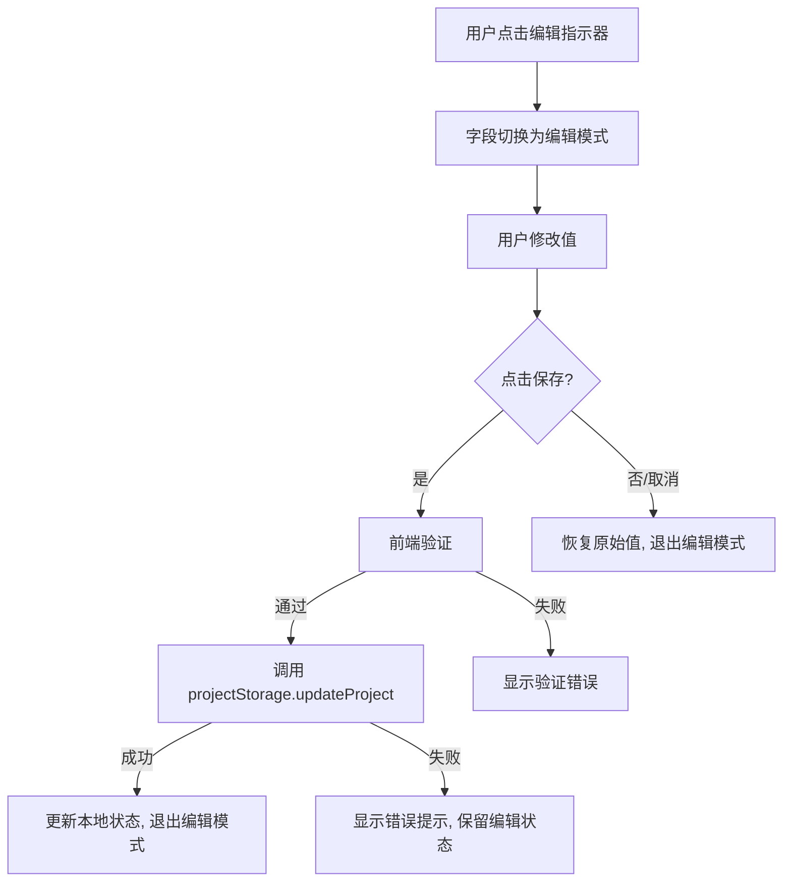
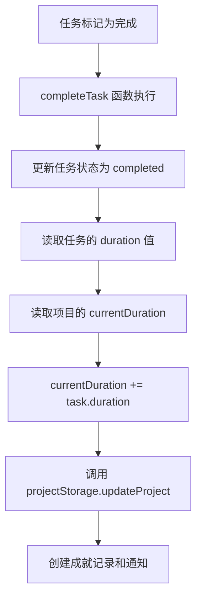

# 设计文档：项目内联编辑

## 概述

本功能为蜂巢平台的项目详情页添加内联编辑能力，使项目创建者和管理员可以直接在详情页上编辑项目字段，无需跳转到独立编辑页面。同时引入任务时长（duration）字段，实现任务完成后自动累加项目进度，并将全应用的时长单位从分钟统一为秒。此外，优化项目详情页布局，将任务区域提升到更显眼的位置。

## 架构

### 整体方案

采用组件化的内联编辑方案，核心思路：

1. 创建一组通用的 `InlineEdit` 组件，支持不同字段类型（文本、富文本、下拉、数字、文件上传）
2. 在项目详情页中，将原有的静态展示替换为可切换编辑/展示模式的内联编辑组件
3. 通过权限判断（`isOwner || isAdmin`）控制编辑能力的显示
4. 修改 `completeTask` 函数，在任务完成时自动累加 duration 到项目的 currentDuration
5. 全局替换时长单位从分钟到秒

### 数据流





## 组件与接口

### 1. InlineEditText 组件

用于编辑纯文本字段（title、telegramGroup）。

```typescript
interface InlineEditTextProps {
  value: string;
  onSave: (newValue: string) => Promise<boolean>; // 返回是否保存成功
  canEdit: boolean;
  placeholder?: string;
  validate?: (value: string) => string | null; // 返回错误信息或 null
  displayClassName?: string;
  inputClassName?: string;
}
```

行为：
- 展示模式：显示文本值 + 编辑图标（hover 时显示）
- 编辑模式：显示 input + 保存/取消按钮
- 按 Enter 保存，按 Escape 取消

### 2. InlineEditRichText 组件

用于编辑 description 字段，复用现有的 `RichTextEditor` 组件。

```typescript
interface InlineEditRichTextProps {
  value: string;
  onSave: (newValue: string) => Promise<boolean>;
  canEdit: boolean;
}
```

行为：
- 展示模式：通过 `dangerouslySetInnerHTML` 渲染 HTML
- 编辑模式：显示 RichTextEditor + 保存/取消按钮

### 3. InlineEditSelect 组件

用于编辑 category 字段。

```typescript
interface InlineEditSelectProps {
  value: string;
  options: { value: string; label: string }[];
  onSave: (newValue: string) => Promise<boolean>;
  canEdit: boolean;
}
```

### 4. InlineEditNumber 组件

用于编辑 targetDuration 和 currentDuration 字段。

```typescript
interface InlineEditNumberProps {
  value: number;
  onSave: (newValue: number) => Promise<boolean>;
  canEdit: boolean;
  min?: number;
  max?: number;
  suffix?: string; // 如 "秒"
  validate?: (value: number) => string | null;
}
```

### 5. InlineEditFile 组件

用于编辑 coverImage 和 videoFile 字段。

```typescript
interface InlineEditFileProps {
  value: string;
  onSave: (newValue: string) => Promise<boolean>;
  canEdit: boolean;
  accept: string; // 如 "image/jpeg,image/png"
  fileType: 'image' | 'video';
}
```

### 6. 权限判断逻辑

在项目详情页中扩展现有的 `isOwner` 判断：

```typescript
// 现有
const isOwner = user && project && user.id === project.creatorId;

// 新增
const isAdminUser = isAdmin(user);
const canEdit = isOwner || isAdminUser;
const canDelete = isAdminUser;
```

### 7. completeTask 函数修改

在 `taskActions.ts` 中的 `completeTask` 函数增加 duration 累加逻辑：

```typescript
export function completeTask(
  projectId: string,
  taskId: string,
  contributorName: string,
  projectName: string,
  taskName: string,
): StorageResult<void> {
  // ... 现有逻辑 ...

  // 新增：累加任务 duration 到项目 currentDuration
  const projectResult = projectStorage.getProjectById(projectId);
  if (projectResult.success && projectResult.data) {
    const project = projectResult.data;
    const task = (project.tasks || []).find(t => t.id === taskId);
    if (task && task.duration) {
      projectStorage.updateProject(projectId, {
        currentDuration: project.currentDuration + task.duration,
      });
    }
  }

  return { success: true };
}
```

## 数据模型

### Task 类型变更

```typescript
export interface Task {
  id: string;
  prompt: string;
  referenceImages: string[];
  requirements: string;
  creatorEmail: string;
  status: TaskStatus;
  contributorName?: string;
  duration: number;        // 新增：任务时长（5-30秒）
  order: number;
  createdAt: string;
  updatedAt: string;
}
```

### Project 类型说明

Project 接口本身不变，但 `targetDuration` 和 `currentDuration` 的语义从分钟改为秒。这是一个纯语义变更，不需要修改类型定义，但需要更新所有 UI 展示和种子数据。

### 验证规则

| 字段 | 验证规则 |
|------|---------|
| title | 非空，至少 1 个字符 |
| description | 非空（去除 HTML 标签后） |
| category | 必须是预定义选项之一 |
| targetDuration | 正整数 |
| currentDuration | 非负整数 |
| telegramGroup | 空值或有效 URL |
| duration (Task) | 整数，5 ≤ value ≤ 30 |


## 正确性属性

*正确性属性是一种在系统所有有效执行中都应成立的特征或行为——本质上是关于系统应该做什么的形式化陈述。属性是人类可读规格与机器可验证正确性保证之间的桥梁。*

### Property 1: 编辑保存 round-trip

*For any* 可编辑字段和任意有效值，通过内联编辑保存后，从 localStorage 读取该项目应返回包含更新值的项目对象。

**Validates: Requirements 1.3**

### Property 2: 取消编辑恢复原始值

*For any* 可编辑字段，进入编辑模式修改值后点击取消，字段显示值应等于进入编辑模式前的原始值。

**Validates: Requirements 1.4**

### Property 3: 权限控制编辑可见性

*For any* 用户和任意项目，编辑控件的可见性应等于 `(user.id === project.creatorId) || (user.role === 'admin' || user.role === 'super_admin')`。非授权用户不应看到任何编辑或删除控件。

**Validates: Requirements 1.5, 2.1, 2.4**

### Property 4: 任务 duration 范围验证

*For any* 整数值 n，当 n < 5 或 n > 30 时，TaskForm 的 duration 验证应返回错误；当 5 ≤ n ≤ 30 时，验证应通过。

**Validates: Requirements 3.3**

### Property 5: 任务完成自动累加 duration

*For any* 项目和该项目下的任意任务（duration 为 d），当该任务被标记为完成后，项目的 currentDuration 应等于完成前的 currentDuration + d。

**Validates: Requirements 3.4**

### Property 6: targetDuration 正整数验证

*For any* 输入值，targetDuration 的内联编辑验证应仅接受正整数（> 0），拒绝 0、负数、小数和非数字输入。

**Validates: Requirements 6.2**

### Property 7: telegramGroup URL 格式验证

*For any* 非空字符串，telegramGroup 的验证应仅接受有效 URL 格式的字符串，拒绝非 URL 格式的输入。空字符串应被接受（该字段可选）。

**Validates: Requirements 6.3**

### Property 8: 管理员删除项目

*For any* 管理员用户和任意项目，执行删除操作后，通过 `projectStorage.getProjectById` 查询该项目应返回 null。

**Validates: Requirements 2.2**

### Property 9: currentDuration 非负整数验证

*For any* 输入值，currentDuration 的内联编辑验证应仅接受非负整数（≥ 0），拒绝负数、小数和非数字输入。

**Validates: Requirements 3.5**

## 错误处理

| 场景 | 处理方式 |
|------|---------|
| localStorage 空间不足 | 显示 Toast 错误提示，保留编辑状态不丢失用户输入 |
| 项目不存在（已被删除） | 显示"项目不存在"提示，引导返回首页 |
| 验证失败 | 在字段下方显示红色错误文本，阻止保存 |
| 文件上传失败 | 显示上传失败提示，保留当前文件 |
| 并发编辑冲突 | 由于使用 localStorage（单用户），不存在并发问题 |

## 测试策略

### 单元测试

- 验证函数测试：测试各字段的验证逻辑（title 非空、duration 范围、URL 格式等）
- completeTask 函数测试：测试任务完成后 duration 累加逻辑
- 权限判断测试：测试 canEdit/canDelete 在不同用户角色下的返回值
- 边界情况：空白 title、duration 为 5 和 30 的边界值、localStorage 满时的行为

### 属性测试

使用 `fast-check` 库进行属性测试，每个属性至少运行 100 次迭代。

- **Feature: project-inline-edit, Property 1**: 编辑保存 round-trip
- **Feature: project-inline-edit, Property 4**: 任务 duration 范围验证
- **Feature: project-inline-edit, Property 5**: 任务完成自动累加 duration
- **Feature: project-inline-edit, Property 6**: targetDuration 正整数验证
- **Feature: project-inline-edit, Property 7**: telegramGroup URL 格式验证
- **Feature: project-inline-edit, Property 9**: currentDuration 非负整数验证

### 测试工具

- 测试框架：Jest 或 Vitest（与项目现有配置一致）
- 属性测试库：fast-check
- 组件测试：React Testing Library（用于 UI 交互测试）
