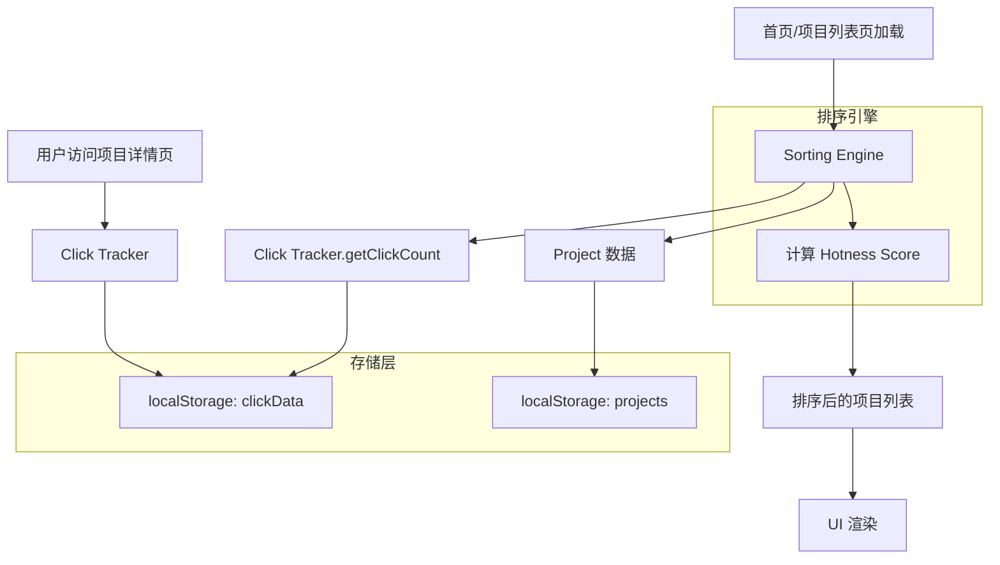

# 设计文档：项目排序/推荐算法

## 概述

本设计为蜂巢AI视频协作平台实现项目排序与推荐算法。核心思路是引入一个独立的点击量追踪模块（Click Tracker）和排序引擎模块（Sorting Engine），在现有 localStorage 存储架构上扩展，为首页精选、分类板块和项目列表页提供基于热度的智能排序能力。

设计遵循以下原则：
- 与现有 `storage.ts` 架构风格保持一致，使用 `StorageResult<T>` 模式
- 排序逻辑作为纯函数实现，便于测试
- 点击数据独立存储，不污染现有 Project 数据结构

## 架构



整体架构分为三层：
1. **数据采集层**：Click Tracker 负责记录和查询点击事件
2. **计算层**：Sorting Engine 负责热度分数计算和多策略排序
3. **展示层**：各页面组件调用排序引擎获取排序后的项目列表

## 组件与接口

### 1. Click Tracker（点击追踪器）

文件位置：`src/lib/clickTracker.ts`

```typescript
// 点击事件记录
interface ClickEvent {
  projectId: string;
  timestamp: number; // Unix 毫秒时间戳
  userId?: string;   // 可选，用于去重
}

// 点击数据存储结构
interface ClickData {
  events: ClickEvent[];
  lastCleanup: number; // 上次清理时间戳
}

export const clickTracker = {
  // 记录一次点击（含5分钟去重逻辑）
  recordClick(projectId: string, userId?: string): StorageResult<void>,
  
  // 获取指定时间窗口内的点击次数（默认24小时）
  getClickCount(projectId: string, windowMs?: number): StorageResult<number>,
  
  // 批量获取多个项目的点击次数（减少重复解析）
  getBatchClickCounts(projectIds: string[], windowMs?: number): StorageResult<Record<string, number>>,
  
  // 清理过期数据（超过7天的记录）
  cleanup(): StorageResult<number>, // 返回清理的记录数
};
```

### 2. Sorting Engine（排序引擎）

文件位置：`src/lib/sortingEngine.ts`

```typescript
// 排序方式枚举
type SortOption = 'hot' | 'newest' | 'fastest' | 'mostParticipants';

// 热度分数计算配置
interface HotnessConfig {
  clickWindowMs: number;        // 点击统计时间窗口，默认 24 * 60 * 60 * 1000
  decayHalfLifeMs: number;      // 衰减半衰期，默认 24 * 60 * 60 * 1000
  participantsWeight: number;   // 参与者权重系数，默认 2
  progressWeight: number;       // 进度活跃度权重系数，默认 5
}

export const sortingEngine = {
  // 计算单个项目的热度分数
  calculateHotnessScore(project: Project, clickCount: number, config?: Partial<HotnessConfig>): number,
  
  // 按热度排序项目列表
  sortByHotness(projects: Project[], clickCounts: Record<string, number>, config?: Partial<HotnessConfig>): Project[],
  
  // 按指定维度排序
  sortProjects(projects: Project[], sortOption: SortOption, clickCounts?: Record<string, number>): Project[],
  
  // 首页分类板块混合策略排序（前3热门 + 后3最新，去重）
  getCategoryMixedProjects(projects: Project[], clickCounts: Record<string, number>, limit?: number): Project[],
  
  // 获取首页精选项目（按热度取前N个）
  getFeaturedProjects(projects: Project[], clickCounts: Record<string, number>, limit?: number): Project[],
};
```

### 3. 页面集成

#### 首页 (`src/app/page.tsx`)
- 在 `useEffect` 中调用 `clickTracker.getBatchClickCounts` 获取点击数据
- 精选项目：调用 `sortingEngine.getFeaturedProjects`
- 分类板块：调用 `sortingEngine.getCategoryMixedProjects`
- 最新任务：保持不变

#### 项目列表页 (`src/app/projects/page.tsx`)
- 新增排序选项 UI（下拉选择器）
- 新增 `sortOption` 状态，默认值 `'hot'`
- 调用 `sortingEngine.sortProjects` 进行排序
- 切换分类时保持排序选项不变

#### 项目详情页 (`src/app/projects/[id]/page.tsx`)
- 在页面加载时调用 `clickTracker.recordClick`

## 数据模型

### 点击数据存储格式

localStorage key: `projectClickData`

```typescript
interface ClickData {
  events: ClickEvent[];
  lastCleanup: number;
}

interface ClickEvent {
  projectId: string;
  timestamp: number;
  userId?: string;
}
```

存储示例：
```json
{
  "events": [
    { "projectId": "p1", "timestamp": 1700000000000, "userId": "u1" },
    { "projectId": "p2", "timestamp": 1700000100000 }
  ],
  "lastCleanup": 1699900000000
}
```

### 热度分数计算模型

```
hotnessScore = weightedClickScore + participantsScore + progressScore

其中：
- weightedClickScore = Σ(e^(-λ × age_i))，对每次点击按时间衰减求和
  - λ = ln(2) / halfLifeMs
  - age_i = now - clickTimestamp_i
- participantsScore = participantsCount × participantsWeight（默认 ×2）
- progressScore = (currentDuration / targetDuration) × progressWeight（默认 ×5）
```

注意：这里使用逐条点击的指数衰减求和，而非简单的点击计数乘以衰减因子，这样能更精确地反映近期活跃度。

### 排序选项与 URL 参数

项目列表页排序选项通过 URL 查询参数 `sort` 传递：
- `/projects?sort=hot` — 热门（默认）
- `/projects?sort=newest` — 最新
- `/projects?sort=fastest` — 进度最快
- `/projects?sort=mostParticipants` — 参与者最多


## 正确性属性

*正确性属性是一种在系统所有有效执行中都应成立的特征或行为——本质上是关于系统应该做什么的形式化陈述。属性作为人类可读规格说明与机器可验证正确性保证之间的桥梁。*

### Property 1: 点击记录往返一致性

*For any* 项目ID和用户ID，记录一次点击后，查询该项目在当前时间窗口内的点击次数应比记录前增加1。

**Validates: Requirements 1.1, 1.2**

### Property 2: 时间窗口过滤准确性

*For any* 一组带有不同时间戳的点击事件和任意时间窗口 W，`getClickCount(projectId, W)` 返回的数量应等于时间戳在 `[now - W, now]` 范围内的事件数量。

**Validates: Requirements 1.3**

### Property 3: 清理移除过期记录

*For any* 一组点击事件（包含超过7天和未超过7天的记录），执行 cleanup 后，剩余的事件应全部在7天以内，且所有7天内的事件都被保留。

**Validates: Requirements 1.4**

### Property 4: 点击去重

*For any* 项目ID和用户ID，在5分钟内连续记录 N 次点击（N ≥ 1），有效点击计数应为1。

**Validates: Requirements 1.5**

### Property 5: 热度分数公式正确性

*For any* 项目（具有任意 participantsCount、currentDuration、targetDuration）和任意非负点击次数，`calculateHotnessScore` 的返回值应等于 `weightedClickScore + participantsCount × participantsWeight + (currentDuration / targetDuration) × progressWeight`。

**Validates: Requirements 2.1, 2.3, 2.4**

### Property 6: 精选项目为热度最高的前N个

*For any* 项目列表和对应的点击数据，`getFeaturedProjects` 返回的项目集合应是所有项目中 Hotness_Score 最高的前6个（或全部项目，如果不足6个），且按分数降序排列。

**Validates: Requirements 3.1**

### Property 7: 分类混合策略正确性

*For any* 同一分类的项目列表和对应的点击数据，`getCategoryMixedProjects` 返回的结果中：前 min(3, total) 个项目应是该分类中热度最高的项目，其余项目应是按创建时间最新且不在前3中的项目，总数不超过6个且无重复。

**Validates: Requirements 4.1, 4.2**

### Property 8: 排序选项产生正确排序

*For any* 项目列表和任意排序选项（hot/newest/fastest/mostParticipants），`sortProjects` 返回的列表应满足：对于列表中任意相邻的两个项目 A 和 B（A 在 B 前面），A 在所选维度上的值应大于等于 B 的值。

**Validates: Requirements 5.3**

## 错误处理

| 场景 | 处理方式 |
|------|---------|
| localStorage 不可用 | Click Tracker 操作静默失败，返回 `StorageResult` 错误；排序引擎回退到无点击数据模式（仅用参与者和进度排序） |
| 点击数据 JSON 解析失败 | 重置点击数据为空，记录错误日志 |
| 项目 targetDuration 为 0 | 进度百分比视为 0，避免除零错误 |
| localStorage 配额超限 | 触发 cleanup，清理7天前数据后重试一次 |
| 点击数据格式不兼容（版本升级） | 检测到格式不匹配时重置数据 |

## 测试策略

### 属性测试（Property-Based Testing）

使用 `fast-check` 库进行属性测试，每个属性至少运行100次迭代。

每个测试需标注对应的设计属性：
- **Feature: project-sorting-algorithm, Property 1: 点击记录往返一致性**
- **Feature: project-sorting-algorithm, Property 2: 时间窗口过滤准确性**
- **Feature: project-sorting-algorithm, Property 3: 清理移除过期记录**
- **Feature: project-sorting-algorithm, Property 4: 点击去重**
- **Feature: project-sorting-algorithm, Property 5: 热度分数公式正确性**
- **Feature: project-sorting-algorithm, Property 6: 精选项目为热度最高的前N个**
- **Feature: project-sorting-algorithm, Property 7: 分类混合策略正确性**
- **Feature: project-sorting-algorithm, Property 8: 排序选项产生正确排序**

### 单元测试

单元测试聚焦于具体示例和边界情况：
- 时间衰减因子在24小时时为0.5的具体验证（需求 2.2）
- 零点击项目的基础分计算（需求 2.5）
- 热度相同时按创建时间排序的平局处理（需求 3.2）
- 分类项目不足6个时的处理（需求 4.3）
- 默认排序选项为热门（需求 5.1）
- 排序选项 UI 包含全部4个选项（需求 5.2）

### 测试文件结构

```
src/lib/__tests__/
  clickTracker.test.ts      — Click Tracker 单元测试 + 属性测试
  sortingEngine.test.ts     — Sorting Engine 单元测试 + 属性测试
```
