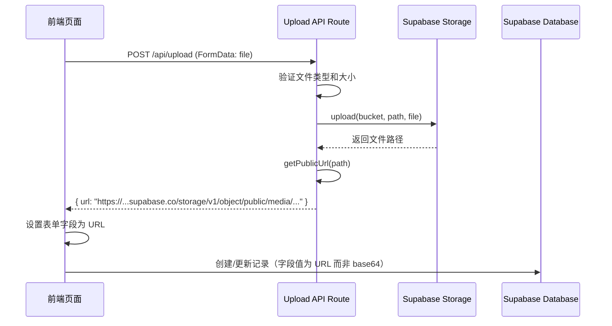

# 设计文档：Supabase Storage 迁移

## 概述

将蜂巢平台的媒体文件存储从数据库 base64 字段迁移到 Supabase Storage 对象存储。核心改动包括：创建 Storage Bucket、新增服务端上传 API、改造前端上传逻辑、兼容已有 base64 数据。

## 架构

### 当前架构（base64）

```
前端选择文件 → FileReader 转 base64 → JSON body 发送到 API Route → 存入数据库 text 字段
```

### 目标架构（Storage URL）

```
前端选择文件 → FormData 发送到 Upload API → 服务端上传到 Supabase Storage → 返回 Public URL → 前端将 URL 存入表单 → JSON body 发送到 API Route → 存入数据库 text 字段（仅 URL）
```



## 组件和接口

### 1. SQL Migration 脚本

创建 `media` 公开 bucket 和 RLS 策略：

```sql
-- 创建 media bucket（公开读取）
INSERT INTO storage.buckets (id, name, public) VALUES ('media', 'media', true);

-- RLS 策略：已认证用户可上传
CREATE POLICY "Authenticated users can upload" ON storage.objects
  FOR INSERT TO authenticated
  WITH CHECK (bucket_id = 'media');

-- RLS 策略：任何人可读取
CREATE POLICY "Public read access" ON storage.objects
  FOR SELECT TO public
  USING (bucket_id = 'media');

-- RLS 策略：用户可删除自己上传的文件
CREATE POLICY "Users can delete own files" ON storage.objects
  FOR DELETE TO authenticated
  USING (bucket_id = 'media' AND (storage.foldername(name))[1] = auth.uid()::text);
```

### 2. Upload API Route (`/api/upload`)

```typescript
// POST /api/upload
// 接收 FormData，包含 file 字段
// 返回 { success: true, data: { url: string } }

interface UploadResponse {
  url: string;
}

// 文件路径格式: {userId}/{timestamp}_{randomId}.{ext}
// 例如: abc123/1700000000000_x7k2m.jpg
```

**验证规则**：
- 文件类型白名单：`image/jpeg`, `image/png`, `image/gif`, `video/mp4`, `video/quicktime`
- 图片大小限制：5MB
- 视频大小限制：50MB
- 需要用户认证

### 3. 前端上传工具函数 (`src/lib/upload.ts`)

```typescript
// 统一的文件上传函数
async function uploadFile(file: File): Promise<string>
// 返回 Public URL，失败时抛出错误

// 判断字符串是否为 base64 格式（兼容旧数据）
function isBase64(str: string): boolean
// 以 "data:" 开头即为 base64
```

### 4. 前端页面改造

需要改造的页面和组件：

| 页面/组件 | 文件路径 | 改动内容 |
|-----------|---------|---------|
| 创建项目 | `src/app/projects/new/page.tsx` | 封面和视频上传改为先调用 Upload API |
| 编辑项目 | `src/app/projects/edit/[id]/page.tsx` | 同上 |
| 个人设置 | `src/app/profile/page.tsx` | 头像上传改为先调用 Upload API |
| 任务表单 | `src/components/TaskForm.tsx` | 参考图片上传改为先调用 Upload API |

**改造模式**（所有页面统一）：

```typescript
// 旧逻辑：
const reader = new FileReader();
reader.readAsDataURL(file);  // 转 base64
setFormData({ coverImage: base64String });  // 存 base64 到表单

// 新逻辑：
const url = await uploadFile(file);  // 上传到 Storage，获取 URL
setFormData({ coverImage: url });  // 存 URL 到表单
```

**兼容性处理**：
- 显示图片/视频时，`src` 属性直接使用字段值（base64 和 URL 都可以作为 `src`）
- 无需修改显示逻辑，`` 和 `<video src={value}>` 天然兼容两种格式

## 数据模型

### 数据库字段变更

无需修改数据库 schema。现有字段类型为 `text`，可以同时存储 base64 字符串和 URL 字符串。

| 表 | 字段 | 当前值 | 迁移后值 |
|----|------|--------|---------|
| projects | cover_image | `data:image/jpeg;base64,...` | `https://xxx.supabase.co/storage/v1/object/public/media/...` |
| projects | video_file | `data:video/mp4;base64,...` | `https://xxx.supabase.co/storage/v1/object/public/media/...` |
| tasks | reference_images | `["data:image/jpeg;base64,..."]` | `["https://xxx.supabase.co/storage/v1/object/public/media/..."]` |
| profiles | avatar | `data:image/png;base64,...` | `https://xxx.supabase.co/storage/v1/object/public/media/...` |

### API 层无需修改

`src/lib/api.ts` 中的 `mapProjectToDb` / `mapDbProjectToProject` 等映射函数无需修改，因为它们只是透传字段值。

## 正确性属性


*正确性属性是指在系统所有合法执行中都应成立的特征或行为——本质上是关于系统应该做什么的形式化陈述。属性是人类可读规范与机器可验证正确性保证之间的桥梁。*

### Property 1: 非法文件类型被拒绝

*对于任意* MIME 类型不在白名单（image/jpeg, image/png, image/gif, video/mp4, video/quicktime）中的文件，Upload API 的文件类型验证函数应返回拒绝结果。

**Validates: Requirements 2.2**

### Property 2: 超大文件被拒绝

*对于任意* 大小超过对应限制（图片 > 5MB，视频 > 50MB）的文件，Upload API 的文件大小验证函数应返回拒绝结果。

**Validates: Requirements 2.3**

### Property 3: 文件路径唯一性

*对于任意* 两次调用文件路径生成函数（即使使用相同的用户ID和文件名），生成的路径应该互不相同。

**Validates: Requirements 2.4**

### Property 4: base64 与 URL 格式正确识别

*对于任意* 以 `data:` 开头的字符串，isBase64 函数应返回 true；*对于任意* 以 `https://` 开头的 URL 字符串，isBase64 函数应返回 false。

**Validates: Requirements 3.3, 4.3, 5.2, 6.2**

## 错误处理

| 场景 | 处理方式 |
|------|---------|
| 文件类型不合法 | Upload API 返回 400，前端显示"不支持的文件格式" |
| 文件大小超限 | Upload API 返回 400，前端显示"文件大小超过限制" |
| 用户未认证 | Upload API 返回 401，前端重定向到登录页 |
| Supabase Storage 上传失败 | Upload API 返回 500，前端显示"上传失败，请重试" |
| 网络错误 | 前端 catch 异常，显示"网络请求失败" |

## 测试策略

### 单元测试

- 文件类型验证函数：测试白名单内外的各种 MIME 类型
- 文件大小验证函数：测试边界值（恰好等于限制、超过限制）
- 文件路径生成函数：测试路径格式和唯一性
- isBase64 判断函数：测试 base64 字符串和 URL 字符串

### 属性测试

使用 `fast-check` 库进行属性测试，每个属性至少运行 100 次迭代。

- **Property 1**: 生成随机 MIME 类型字符串，验证非白名单类型被拒绝
- **Property 2**: 生成随机文件大小，验证超限文件被拒绝
- **Property 3**: 多次调用路径生成函数，验证结果互不相同
- **Property 4**: 生成随机 base64 前缀字符串和 URL 字符串，验证 isBase64 正确分类

### 集成测试（手动）

- 在创建项目页面上传封面图片，验证数据库存储的是 URL 而非 base64
- 在编辑项目页面更换视频，验证新 URL 替换旧值
- 在任务表单上传多张参考图片，验证 reference_images 数组包含 URL
- 在个人设置页面更换头像，验证 avatar 字段为 URL
- 验证已有 base64 数据的项目仍能正常显示
