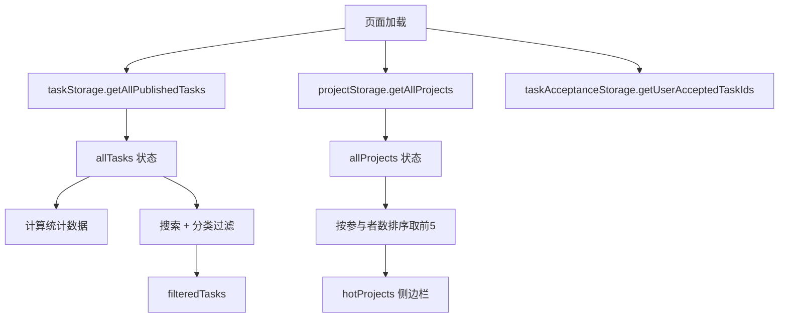

# 设计文档：任务大厅页面重新设计

## 概述

重新设计任务大厅页面（`/tasks`），使其视觉风格与主页保持一致。主要改动包括：新增 Hero 区域和统计面板、添加搜索功能、增强分类筛选栏、优化任务卡片视觉效果、引入左右两栏布局（主内容 + 侧边栏）。

页面继续使用 `LayoutSimple` 组件作为外层布局（提供导航栏、胶片纹理、页脚），但内部内容区域将完全重写。

## 架构

### 页面结构

```
LayoutSimple (已有)
└── TaskHallPage (重写)
    ├── Hero Section (新增)
    │   ├── 光晕效果装饰
    │   ├── 标题 + 描述
    │   └── 统计面板 (Stats Cards)
    ├── Search + Category Filter Bar (增强)
    │   ├── 搜索输入框
    │   └── 分类按钮（带计数）
    └── Main Content (两栏布局)
        ├── Left: 任务列表
        │   ├── TaskCard[] (增强)
        │   └── 空状态提示
        └── Right: Sidebar
            └── 热门项目列表
```

### 数据流



## 组件与接口

### TaskHallPage 组件（重写 `src/app/tasks/page.tsx`）

不拆分为多个子组件文件，所有新增 UI 直接写在页面组件内部，保持简单。

**状态定义：**
```typescript
const [allTasks, setAllTasks] = useState<PublishedTask[]>([]);
const [filteredTasks, setFilteredTasks] = useState<PublishedTask[]>([]);
const [selectedCategory, setSelectedCategory] = useState('all');
const [searchQuery, setSearchQuery] = useState('');
const [acceptedTaskIds, setAcceptedTaskIds] = useState<string[]>([]);
const [hotProjects, setHotProjects] = useState<Project[]>([]);
```

**过滤逻辑：**
```typescript
useEffect(() => {
  let result = allTasks;
  // 分类过滤
  if (selectedCategory !== 'all') {
    result = result.filter(t => t.projectCategory === selectedCategory);
  }
  // 搜索过滤
  if (searchQuery.trim()) {
    const query = searchQuery.toLowerCase();
    result = result.filter(t => t.prompt.toLowerCase().includes(query));
  }
  setFilteredTasks(result);
}, [selectedCategory, searchQuery, allTasks]);
```

**统计计算：**
```typescript
// 直接在渲染中计算，无需额外状态
const totalCount = allTasks.length;
const categoryCountMap = allTasks.reduce((acc, t) => {
  acc[t.projectCategory] = (acc[t.projectCategory] || 0) + 1;
  return acc;
}, {} as Record<string, number>);
```

**相对时间格式化函数：**
```typescript
function getRelativeTime(dateStr: string): string {
  const now = new Date();
  const date = new Date(dateStr);
  const diffMs = now.getTime() - date.getTime();
  const diffMinutes = Math.floor(diffMs / 60000);
  const diffHours = Math.floor(diffMs / 3600000);
  const diffDays = Math.floor(diffMs / 86400000);

  if (diffMinutes < 1) return t('justNow');
  if (diffMinutes < 60) return t('minutesAgo', { count: diffMinutes });
  if (diffHours < 24) return t('hoursAgo', { count: diffHours });
  if (diffDays < 30) return t('daysAgo', { count: diffDays });
  return t('longAgo');
}
```

### TaskCard 组件增强

在现有 `TaskCard.tsx` 基础上增加以下展示信息：
- 创建时间（相对时间格式）
- 任务时长（duration 字段）

这些信息已经通过 `task` prop 传入，只需在渲染中添加展示即可。

### 热门项目侧边栏卡片

直接在页面内定义，不单独创建组件文件：
```typescript
function HotProjectCard({ project, index }: { project: Project; index: number }) {
  return (
    <Link href={`/projects/${project.id}`}>
      <div className="p-4 rounded-[var(--radius-lg)] bg-[var(--ink-light)] border border-[var(--ink-border)] hover:border-[var(--gold)]/30 transition-colors group cursor-pointer">
        <div className="flex items-center gap-3">
          <span className="text-lg font-medium text-[var(--gold)]">#{index + 1}</span>
          <div className="flex-1 min-w-0">
            <p className="text-sm text-[var(--text-primary)] truncate group-hover:text-[var(--gold)] transition-colors">
              {project.title}
            </p>
            <span className="text-xs text-[var(--text-muted)]">
              {project.participantsCount} 参与者
            </span>
          </div>
        </div>
      </div>
    </Link>
  );
}
```

## 数据模型

无新增数据模型。使用现有的 `Task`、`Project` 类型和 `PublishedTask` 扩展类型：

```typescript
type PublishedTask = Task & {
  projectId: string;
  projectName: string;
  projectCategory: string;
};
```

热门项目直接使用现有 `Project` 类型，按 `participantsCount` 降序排序取前 5 个。

## 正确性属性

*正确性属性是指在系统所有有效执行中都应保持为真的特征或行为——本质上是关于系统应该做什么的形式化陈述。属性作为人类可读规范和机器可验证正确性保证之间的桥梁。*

### Property 1: 统计计数准确性
*对于任意*已发布任务列表，统计面板显示的总数应等于列表长度，且各类别计数之和应等于总数。
**Validates: Requirements 2.1, 2.2, 4.2**

### Property 2: 搜索过滤正确性
*对于任意*搜索关键词和任务列表，过滤后的结果中每个任务的 prompt 字段都应包含该关键词（不区分大小写），且所有包含该关键词的任务都应出现在结果中。
**Validates: Requirements 3.2**

### Property 3: 任务卡片信息完整性
*对于任意*已发布任务，渲染后的任务卡片应包含项目类别标签、创建时间信息和任务时长信息。
**Validates: Requirements 5.3, 5.4, 5.5**

### Property 4: 热门项目排序正确性
*对于任意*项目列表，侧边栏展示的热门项目应按参与者数量降序排列，且列表长度不超过 5。
**Validates: Requirements 6.2**

### Property 5: 相对时间格式化正确性
*对于任意*有效的 ISO 时间戳，相对时间格式化函数应返回非空字符串，且对于越近的时间应返回越小的时间单位（分钟 < 小时 < 天）。
**Validates: Requirements 5.4**

## 错误处理

| 场景 | 处理方式 |
|------|---------|
| localStorage 读取失败 | 显示空列表，不阻塞页面渲染 |
| 任务数据为空 | 显示空状态提示，引导用户浏览项目 |
| 搜索无结果 | 显示搜索空状态，提示尝试其他关键词 |
| 项目数据加载失败 | 侧边栏显示空状态，不影响主内容区域 |

## 测试策略

### 单元测试
- 统计计算逻辑的正确性（特定示例）
- 搜索过滤的边界情况（空字符串、特殊字符）
- 相对时间格式化的边界值（刚刚、1分钟前、1小时前、1天前）
- 热门项目排序的边界情况（空列表、相同参与者数）

### 属性测试
- 使用 `fast-check` 库进行属性测试
- 每个属性测试至少运行 100 次迭代
- 每个测试用注释标注对应的设计文档属性编号
- 标注格式：**Feature: task-hall-redesign, Property {number}: {property_text}**

### 测试范围
- 统计计算纯函数
- 搜索过滤纯函数
- 相对时间格式化纯函数
- 热门项目排序纯函数
- 组件渲染测试（检查关键 DOM 元素存在性）

### 国际化
- 新增的 i18n 键需要同时提供英文和中文翻译
- 新增键包括：搜索占位符、统计标签、相对时间格式、侧边栏标题等
