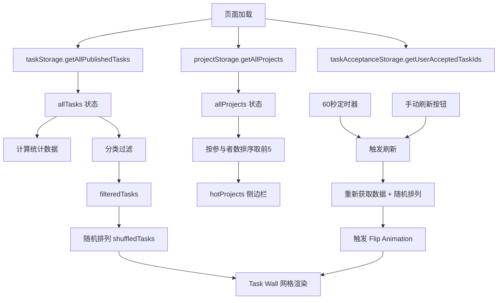

# 设计文档：任务墙重新设计

## 概述

将任务大厅页面（`/tasks`）的任务展示区域从列表式改为游戏风格的"任务墙"。核心改动：

1. 任务展示从垂直列表改为 4 列网格便签布局，每张便签默认只显示首张参考图片
2. 新增悬停信息叠加层（标题、时长、提示词缩写）
3. 新增点击弹窗展示完整任务详情（替代原有的展开/折叠）
4. 新增自动刷新（60秒）+ 手动刷新 + 倒计时显示
5. 刷新时所有便签执行 3D 翻转动画
6. 统计面板兼具分类筛选功能，移除独立搜索栏
7. 保留 Hero 区域、侧边栏、国际化支持

页面继续使用 `LayoutSimple` 组件作为外层布局，内部任务展示区域完全重写。

## 架构

### 页面结构

```
LayoutSimple (已有)
└── TaskHallPage (重写)
    ├── Hero Section (保留)
    │   ├── 光晕效果装饰
    │   └── 标题 + 描述
    ├── Stats Filter Panel (改造)
    │   └── 统计卡片（可点击筛选）
    ├── Refresh Timer Bar (新增)
    │   ├── 倒计时文本 "距离下次刷新还剩 MM:SS"
    │   └── 手动刷新图标按钮
    └── Main Content (两栏布局)
        ├── Left: Task Wall (新增)
        │   ├── 4列网格
        │   │   └── TaskNote[] (新增)
        │   └── 空状态提示
        ├── Right: Sidebar (保留)
        │   └── 热门项目列表
        └── TaskDetailModal (新增，条件渲染)
```

### 数据流



## 组件与接口

### TaskHallPage 组件（重写 `src/app/tasks/page.tsx`）

**状态定义：**
```typescript
const [allTasks, setAllTasks] = useState<PublishedTask[]>([]);
const [filteredTasks, setFilteredTasks] = useState<PublishedTask[]>([]);
const [selectedCategory, setSelectedCategory] = useState('all');
const [acceptedTaskIds, setAcceptedTaskIds] = useState<string[]>([]);
const [hotProjects, setHotProjects] = useState<Project[]>([]);
const [countdown, setCountdown] = useState(60);       // 倒计时秒数
const [isFlipping, setIsFlipping] = useState(false);   // 翻转动画状态
const [selectedTask, setSelectedTask] = useState<PublishedTask | null>(null); // 弹窗任务
```

**刷新逻辑：**
```typescript
// 洗牌函数
function shuffleArray<T>(arr: T[]): T[] {
  const shuffled = [...arr];
  for (let i = shuffled.length - 1; i > 0; i--) {
    const j = Math.floor(Math.random() * (i + 1));
    [shuffled[i], shuffled[j]] = [shuffled[j], shuffled[i]];
  }
  return shuffled;
}

// 刷新处理
const handleRefresh = useCallback(() => {
  setIsFlipping(true);
  setTimeout(() => {
    const result = taskStorage.getAllPublishedTasks();
    if (result.success && result.data) {
      setAllTasks(result.data);
    }
    setIsFlipping(false);
    setCountdown(60);
  }, 600); // 等待翻转动画完成后更新数据
}, []);

// 自动刷新定时器
useEffect(() => {
  const interval = setInterval(() => {
    setCountdown(prev => {
      if (prev <= 1) {
        handleRefresh();
        return 60;
      }
      return prev - 1;
    });
  }, 1000);
  return () => clearInterval(interval);
}, [handleRefresh]);
```

**过滤逻辑（移除搜索，只保留分类）：**
```typescript
useEffect(() => {
  let result = allTasks;
  if (selectedCategory !== 'all') {
    result = result.filter(t => t.projectCategory === selectedCategory);
  }
  setFilteredTasks(shuffleArray(result));
}, [selectedCategory, allTasks]);
```

### TaskNote 组件（内联定义）

便签卡片组件，在页面文件内定义，不单独创建文件。

```typescript
interface TaskNoteProps {
  task: PublishedTask;
  isFlipping: boolean;
  onClick: (task: PublishedTask) => void;
}

function TaskNote({ task, isFlipping, onClick }: TaskNoteProps) {
  const firstImage = task.referenceImages?.[0];
  const titlePreview = task.prompt.slice(0, 20);
  const promptPreview = task.prompt.length > 50
    ? task.prompt.slice(0, 50) + '...'
    : task.prompt;

  return (
    <div
      className={`task-note-container ${isFlipping ? 'flipping' : ''}`}
      onClick={() => onClick(task)}
    >
      <div className="task-note-inner">
        <div className="task-note-front card cursor-pointer group relative overflow-hidden aspect-[3/4]">
          {firstImage ? (
            
          ) : (
            <div className="w-full h-full bg-[var(--ink-lighter)] flex items-center justify-center">
              <span className="text-[var(--text-muted)]">No Image</span>
            </div>
          )}
          {/* 悬停信息叠加层 */}
          <div className="absolute inset-0 bg-black/70 opacity-0 group-hover:opacity-100 transition-opacity duration-[var(--duration-fast)] flex flex-col justify-end p-4">
            <p className="text-sm font-medium text-[var(--text-primary)] mb-1">{titlePreview}</p>
            <p className="text-xs text-[var(--gold)] mb-2">{task.duration}s</p>
            <p className="text-xs text-[var(--text-secondary)] line-clamp-2">{promptPreview}</p>
          </div>
        </div>
        <div className="task-note-back card aspect-[3/4] flex items-center justify-center bg-[var(--ink-light)]">
          <div className="w-8 h-8 border-2 border-[var(--gold)] border-t-transparent rounded-full animate-spin" />
        </div>
      </div>
    </div>
  );
}
```

### TaskDetailModal 组件（内联定义）

```typescript
interface TaskDetailModalProps {
  task: PublishedTask;
  isLoggedIn: boolean;
  hasAccepted: boolean;
  onAccept: (task: Task) => void;
  onClose: () => void;
}

function TaskDetailModal({ task, isLoggedIn, hasAccepted, onAccept, onClose }: TaskDetailModalProps) {
  // 阻止背景滚动
  useEffect(() => {
    document.body.style.overflow = 'hidden';
    return () => { document.body.style.overflow = ''; };
  }, []);

  return (
    <div className="fixed inset-0 z-50 flex items-center justify-center p-4" onClick={onClose}>
      <div className="absolute inset-0 bg-black/60" />
      <div
        className="relative card p-6 max-w-2xl w-full max-h-[90vh] overflow-y-auto animate-scale-in"
        onClick={e => e.stopPropagation()}
      >
        {/* 关闭按钮 */}
        {/* 参考图片 */}
        {/* 完整提示词 */}
        {/* 任务需求 */}
        {/* 任务时长、项目名称、分类、创建者邮箱 */}
        {/* 接受任务按钮 */}
      </div>
    </div>
  );
}
```

### 翻转动画 CSS（添加到 globals.css）

```css
/* 任务便签翻转动画 */
.task-note-container {
  perspective: 1000px;
}

.task-note-inner {
  position: relative;
  transition: transform 600ms var(--ease-out);
  transform-style: preserve-3d;
}

.task-note-container.flipping .task-note-inner {
  transform: rotateY(180deg);
}

.task-note-front,
.task-note-back {
  backface-visibility: hidden;
}

.task-note-back {
  position: absolute;
  inset: 0;
  transform: rotateY(180deg);
}
```

## 数据模型

无新增数据模型。继续使用现有类型：

```typescript
// 已有类型
type PublishedTask = Task & {
  projectId: string;
  projectName: string;
  projectCategory: string;
};

// Task 接口（已有）
interface Task {
  id: string;
  prompt: string;
  referenceImages: string[];
  requirements: string;
  creatorEmail: string;
  status: TaskStatus;
  duration: number;
  order: number;
  createdAt: string;
  updatedAt: string;
}
```


## 正确性属性

*正确性属性是指在系统所有有效执行中都应保持为真的特征或行为——本质上是关于系统应该做什么的形式化陈述。属性作为人类可读规范和机器可验证正确性保证之间的桥梁。*

### Property 1: 统计计数准确性

*对于任意*已发布任务列表，统计面板显示的总数应等于列表长度，且各类别计数之和应等于总数。

**Validates: Requirements 7.1**

### Property 2: 分类过滤正确性

*对于任意*任务列表和任意分类名称，过滤后的结果中每个任务的 projectCategory 都应等于所选分类，且原列表中所有属于该分类的任务都应出现在过滤结果中。

**Validates: Requirements 7.3**

### Property 3: 洗牌不变量

*对于任意*数组，洗牌后的数组应包含与原数组完全相同的元素（相同的长度和相同的元素集合），仅顺序可能不同。

**Validates: Requirements 4.3, 5.2**

### Property 4: 提示词截断正确性

*对于任意*字符串 prompt，标题预览应等于 prompt 的前 20 个字符；提示词缩写在 prompt 长度超过 50 时应为前 50 个字符加 "..."，否则应等于原始 prompt。

**Validates: Requirements 2.2**

### Property 5: 弹窗信息完整性

*对于任意*已发布任务对象，弹窗渲染后的内容应包含该任务的所有参考图片、完整提示词文本、任务需求说明、任务时长、创建者邮箱、项目名称和项目分类。

**Validates: Requirements 3.2**

## 错误处理

| 场景 | 处理方式 |
|------|---------|
| localStorage 读取失败 | 显示空任务墙，不阻塞页面渲染 |
| 任务数据为空 | 显示空状态提示，引导用户浏览其他分类 |
| 任务无参考图片 | 便签显示占位符背景 |
| 项目数据加载失败 | 侧边栏显示空状态，不影响任务墙区域 |
| 弹窗中接受任务失败 | 显示错误提示，不关闭弹窗 |
| 定时器异常 | 页面卸载时确保清除所有定时器 |

## 测试策略

### 单元测试

- 统计计算逻辑的具体示例（空列表、单分类、多分类）
- 分类过滤的边界情况（空分类、不存在的分类）
- 倒计时重置行为
- 弹窗打开/关闭时 body overflow 的设置
- 空状态渲染条件

### 属性测试

- 使用 `fast-check` 库进行属性测试
- 每个属性测试至少运行 100 次迭代
- 每个测试用注释标注对应的设计文档属性编号
- 标注格式：**Feature: task-wall-redesign, Property {number}: {property_text}**

### 测试范围

| 测试类型 | 覆盖内容 |
|---------|---------|
| 属性测试 | 统计计算、分类过滤、洗牌函数、提示词截断 |
| 单元测试 | 边界情况、错误条件、组件渲染 |
| 组件测试 | 弹窗信息完整性、空状态渲染、倒计时显示 |

### 国际化

新增的 i18n 键需要同时提供英文和中文翻译，包括：
- 倒计时文本（`refreshCountdown`）
- 手动刷新按钮提示（`manualRefresh`）
- 弹窗中的标签文本
- 空状态提示文本
