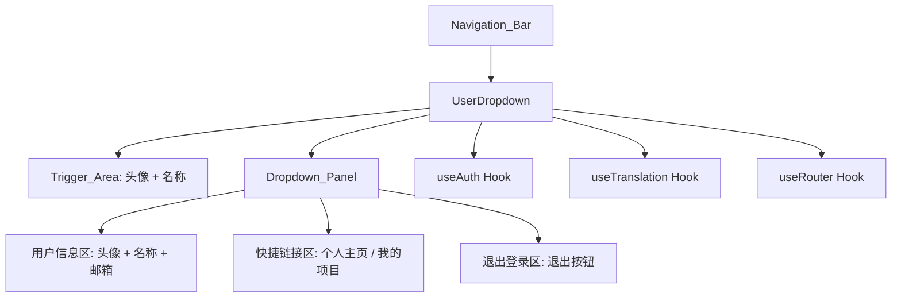
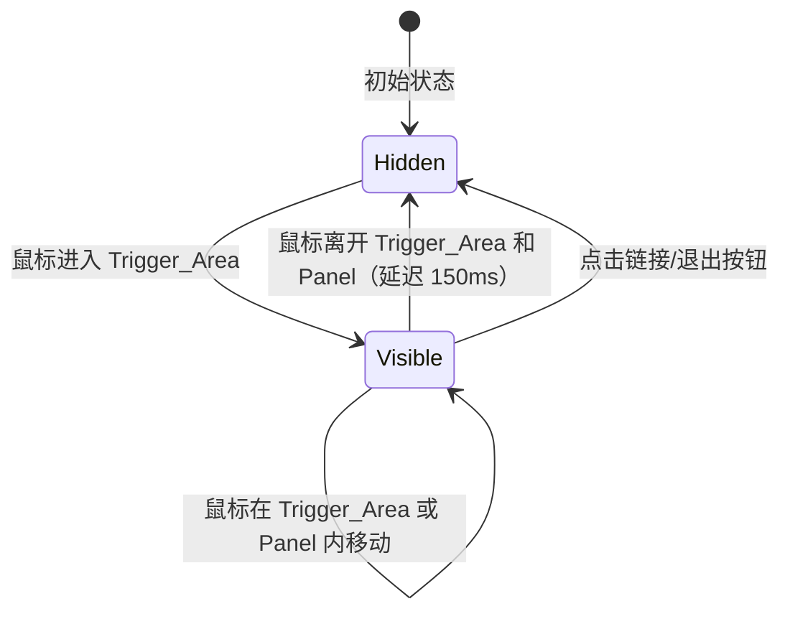

# 设计文档：用户悬停下拉菜单

## 概述

创建一个独立的 `UserDropdown` React 组件，通过鼠标悬停触发显示浮动面板。该组件将整合用户信息展示、快捷导航和退出登录功能，替代导航栏中现有的分散式用户操作区域。组件需同时集成到首页导航栏（page.tsx）和共享头部组件（HeaderSimple.tsx）中。

## 架构



交互流程：



## 组件与接口

### UserDropdown 组件

文件路径：`src/components/UserDropdown.tsx`

```typescript
interface UserDropdownProps {
  user: {
    name: string;
    email: string;
    avatar: string;
  };
  onLogout: () => void;
}
```

组件内部状态：
- `isOpen: boolean` — 控制面板显示/隐藏
- `timeoutRef: useRef<NodeJS.Timeout>` — 延迟关闭定时器引用

关键行为：
- `handleMouseEnter`: 清除关闭定时器，设置 `isOpen = true`
- `handleMouseLeave`: 设置 150ms 延迟后关闭面板（防止鼠标从触发区移动到面板时闪烁）
- `handleLinkClick`: 关闭面板，由 Next.js `<Link>` 处理导航
- `handleLogout`: 调用 `onLogout`，关闭面板

### 面板结构

```
┌─────────────────────────┐
│  [头像]  用户名称        │  ← 用户信息区
│          user@email.com  │
├─────────────────────────┤  ← 分隔线
│  👤 个人主页             │  ← 快捷链接
│  📁 我的项目             │
├─────────────────────────┤  ← 分隔线
│  🚪 退出登录             │  ← 退出区域
└─────────────────────────┘
```

注：实际使用 SVG 图标，不使用 emoji。

### 集成方式

在 `page.tsx` 和 `HeaderSimple.tsx` 中，将现有的：
```tsx
<Link href="/profile" className="flex items-center gap-2 nav-link">
  
  <span>{user?.name}</span>
</Link>
<button onClick={() => { logout(); router.push('/'); }} className="nav-link">
  {t('logout')}
</button>
```

替换为：
```tsx
<UserDropdown
  user={{ name: user.name, email: user.email, avatar: user.avatar }}
  onLogout={() => { logout(); router.push('/'); }}
/>
```

## 数据模型

本功能不引入新的数据模型。使用现有的 `User` 类型：

```typescript
// 来自 src/types/index.ts
interface User {
  id: string;
  name: string;
  email: string;
  avatar: string;
  // ... 其他字段
}
```

### 国际化资源

在 `src/lib/i18n.ts` 中添加以下翻译键：

| 键名 | 英文 | 中文 |
|------|------|------|
| `userDropdown.profile` | `My Profile` | `个人主页` |
| `userDropdown.myProjects` | `My Projects` | `我的项目` |
| `userDropdown.logout` | `Log Out` | `退出登录` |


## 正确性属性

*属性是系统在所有有效执行中都应保持为真的特征或行为——本质上是关于系统应该做什么的形式化陈述。属性作为人类可读规格与机器可验证正确性保证之间的桥梁。*

### 属性 1：悬停开关往返一致性

*对于任意*已登录用户状态，当鼠标进入 Trigger_Area 时面板应变为可见，当鼠标离开 Trigger_Area 和面板区域后面板应变为不可见，最终状态与初始状态一致。

**验证需求：1.1, 1.2**

### 属性 2：用户信息展示完整性

*对于任意*具有 name、email、avatar 字段的用户对象，渲染后的 User_Dropdown 面板应同时包含该用户的头像（img 元素 src 匹配 avatar）、名称文本和邮箱文本。

**验证需求：2.1, 2.2, 2.3**

### 属性 3：链接点击关闭面板

*对于任意*下拉面板中的可点击链接项，点击该链接后面板的 isOpen 状态应变为 false。

**验证需求：3.3**

### 属性 4：菜单项包含图标和国际化文本

*对于任意*支持的语言（en/zh）和任意菜单链接项，该项应同时包含一个 SVG 图标元素和一个来自 i18n 资源的非空文本标签。

**验证需求：3.4, 6.1, 6.2**

## 错误处理

| 场景 | 处理方式 |
|------|----------|
| 用户头像加载失败 | `` 标签使用 `onError` 回调，将 src 替换为 `/default-avatar.svg` |
| 用户对象字段缺失 | 使用可选链和默认值：`user?.name \|\| ''`，`user?.email \|\| ''` |
| 鼠标快速移入移出 | 使用 150ms 延迟定时器（timeoutRef），防止面板闪烁 |
| 组件卸载时定时器泄漏 | 在 `useEffect` cleanup 中清除 timeoutRef |

## 测试策略

### 双重测试方法

本功能采用单元测试与属性测试相结合的方式：

- **单元测试**：验证具体示例、边界情况和错误条件
  - 未登录时不渲染 UserDropdown
  - 退出按钮调用 onLogout 回调
  - 面板显示时包含 animate-scale-in 类名
  - 头像加载失败时显示默认头像
  - i18n 资源文件包含所有必需的翻译键

- **属性测试**：验证跨所有输入的通用属性
  - 使用 `fast-check` 作为属性测试库
  - 每个属性测试至少运行 100 次迭代
  - 每个测试通过注释引用设计文档中的属性编号
  - 标签格式：**Feature: user-hover-dropdown, Property {number}: {property_text}**

### 测试工具

- 测试框架：与项目现有测试框架保持一致（Jest / Vitest）
- 组件测试：React Testing Library（`@testing-library/react`）
- 属性测试：`fast-check`
- 用户事件模拟：`@testing-library/user-event` 或 `fireEvent`
