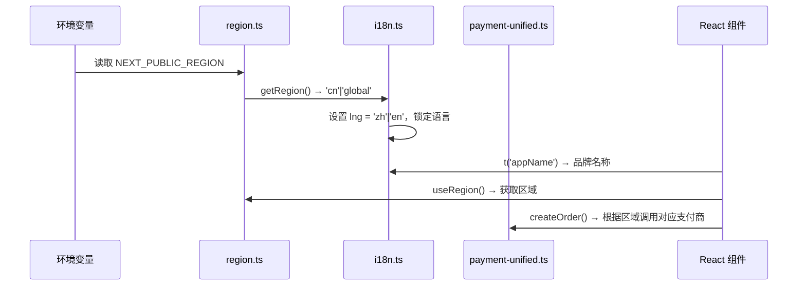

# 设计文档：多区域版本管理

## 概述

本设计实现蜂巢平台的多区域版本管理：国内版（CN）和海外版（Global）。两个版本功能完全一致，差异仅限于：

- **语言**：CN 固定中文，Global 固定英文
- **支付**：CN 使用支付宝/微信支付（已有），Global 使用 Stripe/PayPal（新增，初期 mock）
- **Supabase 实例**：各自独立，通过相同环境变量名指向不同项目
- **部署目标**：CN 自有服务器，Global 通过 Vercel

### 设计原则

1. **极简改动**：不引入 Feature Flag、CDN 配置、地图/分析服务商等无关概念
2. **环境变量驱动**：通过 `NEXT_PUBLIC_REGION` 一个变量区分区域
3. **复用现有代码**：Supabase 客户端、i18n 资源、支付宝集成均保持不变
4. **向后兼容**：未设置区域变量时默认为 CN，现有功能不受影响

### 需要新增/修改的文件

| 操作 | 文件 | 说明 |
|------|------|------|
| 新增 | `src/lib/region.ts` | 区域配置模块 |
| 新增 | `src/lib/payment-unified.ts` | 统一支付接口 |
| 修改 | `src/lib/i18n.ts` | 根据区域锁定语言 |
| 修改 | `src/lib/payment-config.ts` | 扩展 Stripe/PayPal 配置检查 |
| 新增 | `.env.cn.example` | 国内版环境变量模板 |
| 新增 | `.env.global.example` | 海外版环境变量模板 |
| 新增 | `vercel.json` | Vercel 部署配置 |

## 架构

### 系统架构图

```mermaid
graph TB
    subgraph "环境层"
        ENV[NEXT_PUBLIC_REGION=cn|global]
    end

    subgraph "区域配置层"
        ENV --> R[region.ts]
        R --> |getRegion/isCN/isGlobal| APP
        R --> |useRegion Hook| COMP
    end

    subgraph "差异适配层"
        R --> I18N[i18n.ts<br/>CN→zh / Global→en]
        R --> PAY[payment-unified.ts<br/>CN→Alipay,WeChat / Global→Stripe,PayPal]
    end

    subgraph "应用层 APP"
        COMP[React 组件]
        COMP --> I18N
        COMP --> PAY
    end

    subgraph "数据层（不变）"
        SB_CN[Supabase 国内实例]
        SB_GL[Supabase 海外实例]
    end

    APP --> |相同环境变量名| SB_CN
    APP --> |相同环境变量名| SB_GL
```

### 数据流



## 组件和接口

### 1. 区域配置模块 `src/lib/region.ts`

```typescript
/**
 * 区域配置模块
 * 通过 NEXT_PUBLIC_REGION 环境变量确定当前运行区域
 */

export type Region = 'cn' | 'global';

const VALID_REGIONS: Region[] = ['cn', 'global'];

/**
 * 获取当前区域标识，无效值默认返回 'cn'
 */
export function getRegion(): Region {
  const raw = process.env.NEXT_PUBLIC_REGION as string | undefined;

  if (!raw || !VALID_REGIONS.includes(raw as Region)) {
    if (process.env.NODE_ENV === 'development') {
      console.warn(
        `[Region] NEXT_PUBLIC_REGION="${raw}" 无效，回退到 "cn"。有效值: ${VALID_REGIONS.join(', ')}`
      );
    }
    return 'cn';
  }

  return raw as Region;
}

/** 是否为国内版 */
export function isCN(): boolean {
  return getRegion() === 'cn';
}

/** 是否为海外版 */
export function isGlobal(): boolean {
  return getRegion() === 'global';
}
```

#### React Hook（同文件导出）

```typescript
'use client';

import { useMemo } from 'react';
import { getRegion, type Region } from '@/lib/region';

/**
 * React Hook：获取当前区域标识
 * 仅在客户端组件中使用
 */
export function useRegion(): Region {
  return useMemo(() => getRegion(), []);
}
```

> 注意：`useRegion` 单独放在 `src/hooks/useRegion.ts` 中，因为需要 `'use client'` 指令，而 `region.ts` 需要在服务端也能使用。

### 2. i18n 集成（修改现有 `src/lib/i18n.ts`）

仅需修改初始化部分，将硬编码的 `lng: 'zh'` 改为根据区域动态设置：

```typescript
// 修改前：
// lng: 'zh',
// fallbackLng: 'zh',

// 修改后：
import { getRegion } from '@/lib/region';

const regionLangMap = { cn: 'zh', global: 'en' } as const;
const currentLang = regionLangMap[getRegion()];

if (typeof window !== 'undefined') {
  i18n
    .use(initReactI18next)
    .init({
      resources: { en: enResources, zh: zhResources },
      lng: currentLang,
      fallbackLng: currentLang,
      // 禁用语言检测和缓存，锁定语言
      detection: { order: [], caches: [] },
      interpolation: { escapeValue: false },
      react: { useSuspense: false },
    });
}
```

关键改动：
- `lng` 和 `fallbackLng` 由区域决定
- `detection.order` 设为空数组，禁止浏览器自动检测语言
- `detection.caches` 设为空数组，不缓存语言偏好
- 现有 `enResources` 和 `zhResources` 完全不变

### 3. 统一支付接口 `src/lib/payment-unified.ts`

```typescript
import { getRegion } from '@/lib/region';

/** 支付服务商类型 */
export type PaymentProvider = 'alipay' | 'wechat' | 'stripe' | 'paypal';

/** 统一订单创建参数 */
export interface CreateOrderParams {
  outTradeNo: string;
  amountCents: number;
  subject: string;
  returnUrl: string;
  notifyUrl: string;
}

/** 统一订单创建结果 */
export interface CreateOrderResult {
  /** 支付跳转 URL 或二维码内容 */
  payUrl: string;
  /** 实际使用的支付渠道 */
  channel: string;
}

/**
 * 获取当前区域可用的支付方式列表
 */
export function getAvailableProviders(): PaymentProvider[] {
  return getRegion() === 'cn'
    ? ['alipay', 'wechat']
    : ['stripe', 'paypal'];
}

/**
 * 统一创建订单接口
 * CN 区域调用现有 Alipay/WeChat 实现
 * Global 区域调用 Stripe/PayPal（未实现时返回 mock）
 */
export async function createOrder(
  provider: PaymentProvider,
  params: CreateOrderParams
): Promise<CreateOrderResult> {
  const region = getRegion();

  if (region === 'cn') {
    if (provider === 'alipay') {
      // 复用现有 payment.ts 的 createAlipayOrder
      const { createAlipayOrder } = await import('@/lib/payment');
      const payUrl = createAlipayOrder('alipay_pc', {
        ...params,
        body: params.subject,
      });
      return { payUrl, channel: 'alipay_pc' };
    }
    if (provider === 'wechat') {
      const { createWxNativeOrder } = await import('@/lib/payment-wechat');
      const result = await createWxNativeOrder(params);
      return { payUrl: result.codeUrl, channel: 'wx_native' };
    }
  }

  if (region === 'global') {
    if (provider === 'stripe' || provider === 'paypal') {
      // 未实现时使用 mock 模式
      if (process.env.USE_MOCK_PAYMENT === 'true') {
        return {
          payUrl: `/api/recharge/mock-confirm?out_trade_no=${params.outTradeNo}`,
          channel: 'mock',
        };
      }
      // TODO: 实现 Stripe/PayPal 真实对接
      throw new Error(`${provider} 支付尚未实现，请设置 USE_MOCK_PAYMENT=true`);
    }
  }

  throw new Error(`区域 ${region} 不支持支付方式 ${provider}`);
}

/**
 * 统一验证支付回调
 */
export async function verifyPayment(
  provider: PaymentProvider,
  payload: Record<string, string>
): Promise<boolean> {
  if (provider === 'alipay') {
    const { verifyAlipayNotify } = await import('@/lib/payment');
    return verifyAlipayNotify(payload);
  }
  // TODO: Stripe webhook 验签、PayPal IPN 验签
  return false;
}
```

### 4. 支付配置扩展（修改 `src/lib/payment-config.ts`）

在现有 `validatePaymentConfig` 中增加 Stripe/PayPal 检查：

```typescript
// 新增常量
const STRIPE_REQUIRED_VARS = ['STRIPE_PUBLIC_KEY', 'STRIPE_SECRET_KEY'] as const;
const PAYPAL_REQUIRED_VARS = ['PAYPAL_CLIENT_ID', 'PAYPAL_CLIENT_SECRET'] as const;

// 扩展 PaymentConfigStatus 接口
export interface PaymentConfigStatus {
  alipayEnabled: boolean;
  wxPayEnabled: boolean;
  stripeEnabled: boolean;   // 新增
  paypalEnabled: boolean;   // 新增
  mockMode: boolean;
  missingVars: string[];
}

// 在 validatePaymentConfig 中增加检查逻辑
// Stripe 检查
const stripeMissing = checkRequiredVars(STRIPE_REQUIRED_VARS);
missingVars.push(...stripeMissing);
const stripeEnabled = stripeMissing.length === 0;

// PayPal 检查
const paypalMissing = checkRequiredVars(PAYPAL_REQUIRED_VARS);
missingVars.push(...paypalMissing);
const paypalEnabled = paypalMissing.length === 0;
```

### 5. 充值页面区域适配

充值页面根据区域展示不同支付方式，通过 `getAvailableProviders()` 获取：

```typescript
// src/app/recharge/page.tsx 中的关键改动
import { getAvailableProviders } from '@/lib/payment-unified';
import { useRegion } from '@/hooks/useRegion';

// 在组件中
const region = useRegion();
const providers = getAvailableProviders();

// 渲染支付方式按钮时，只展示当前区域的支付方式
{providers.map(p => (
  <PaymentButton key={p} provider={p} />
))}
```

## 数据模型

### 环境变量模型

本系统不引入新的数据库表或字段。区域差异完全通过环境变量控制。

#### `.env.cn.example`（国内版模板）

```bash
# ============================================
# 蜂巢AI视频协作平台 - 国内版环境变量
# ============================================

# 区域配置
NEXT_PUBLIC_REGION=cn

# Supabase（国内实例）
NEXT_PUBLIC_SUPABASE_URL=
NEXT_PUBLIC_SUPABASE_ANON_KEY=
SUPABASE_SERVICE_ROLE_KEY=

# 应用 URL
NEXT_PUBLIC_APP_URL=https://www.yangyangyunhe.cloud

# 支付模式（true=模拟支付，false/不设置=真实支付）
USE_MOCK_PAYMENT=false

# 支付宝
ALIPAY_APP_ID=
ALIPAY_PRIVATE_KEY=
ALIPAY_PUBLIC_KEY=

# 微信支付
WXPAY_APP_ID=
WXPAY_MCHID=
WXPAY_API_KEY=
WXPAY_PRIVATE_KEY=
```

#### `.env.global.example`（海外版模板）

```bash
# ============================================
# Beehive AI Studio - Global Environment
# ============================================

# Region
NEXT_PUBLIC_REGION=global

# Supabase (Global instance)
NEXT_PUBLIC_SUPABASE_URL=
NEXT_PUBLIC_SUPABASE_ANON_KEY=
SUPABASE_SERVICE_ROLE_KEY=

# App URL
NEXT_PUBLIC_APP_URL=https://www.beehiveai.com

# Payment mode (true=mock, required until Stripe/PayPal implemented)
USE_MOCK_PAYMENT=true

# Stripe (future)
# STRIPE_PUBLIC_KEY=
# STRIPE_SECRET_KEY=

# PayPal (future)
# PAYPAL_CLIENT_ID=
# PAYPAL_CLIENT_SECRET=
```

### Vercel 部署配置 `vercel.json`

```json
{
  "framework": "nextjs",
  "buildCommand": "npm run build",
  "outputDirectory": ".next"
}
```

Vercel 环境变量通过 Vercel Dashboard 配置，包括 `NEXT_PUBLIC_REGION=global` 及对应的 Supabase 连接信息。


## 正确性属性

*属性（Property）是指在系统所有有效执行过程中都应该保持为真的特征或行为——本质上是关于系统应该做什么的形式化陈述。属性是人类可读规范和机器可验证正确性保证之间的桥梁。*

### Property 1: 区域解析一致性

*对于任何*有效的区域标识（`'cn'` 或 `'global'`），当设置 `NEXT_PUBLIC_REGION` 为该值时：
- `getRegion()` 应返回该区域标识
- `isCN()` 应返回 `true` 当且仅当区域为 `'cn'`
- `isGlobal()` 应返回 `true` 当且仅当区域为 `'global'`
- `isCN()` 和 `isGlobal()` 应互斥（不能同时为 true 或同时为 false）

**验证需求：1.1, 1.3, 1.4**

### Property 2: 无效区域回退

*对于任何*不是 `'cn'` 或 `'global'` 的字符串（包括 undefined、空字符串、随机字符串），`getRegion()` 应始终返回 `'cn'`，且 `isCN()` 返回 `true`，`isGlobal()` 返回 `false`。

**验证需求：1.2, 9.1**

### Property 3: 区域-支付方式映射正确性

*对于任何*有效区域，`getAvailableProviders()` 返回的支付方式列表应仅包含该区域对应的支付商：
- `'cn'` 区域：列表应包含且仅包含 `'alipay'` 和 `'wechat'`
- `'global'` 区域：列表应包含且仅包含 `'stripe'` 和 `'paypal'`
- 两个区域的支付方式列表不应有交集

**验证需求：4.1, 4.2, 4.3, 10.4**

### Property 4: 支付配置验证完整性

*对于任何*环境变量组合，`validatePaymentConfig()` 返回的 `stripeEnabled` 应为 `true` 当且仅当 `STRIPE_PUBLIC_KEY` 和 `STRIPE_SECRET_KEY` 均已设置；`paypalEnabled` 应为 `true` 当且仅当 `PAYPAL_CLIENT_ID` 和 `PAYPAL_CLIENT_SECRET` 均已设置。

**验证需求：4.6**

## 错误处理

### 1. 区域配置无效

| 场景 | 处理方式 |
|------|---------|
| `NEXT_PUBLIC_REGION` 未设置 | 默认 `'cn'`，开发模式下 console.warn |
| `NEXT_PUBLIC_REGION` 值无效 | 同上 |
| 生产环境无效值 | 静默回退到 `'cn'`，不输出警告 |

### 2. 支付服务商不可用

| 场景 | 处理方式 |
|------|---------|
| Global 区域 Stripe/PayPal 未实现 | `USE_MOCK_PAYMENT=true` 时返回 mock URL |
| Global 区域未设置 mock 且未实现 | 抛出错误，提示设置 `USE_MOCK_PAYMENT=true` |
| 调用了当前区域不支持的支付方式 | 抛出错误，提示区域不支持该支付方式 |

### 3. 支付配置缺失

| 场景 | 处理方式 |
|------|---------|
| CN 区域缺少支付宝/微信配置 | 现有逻辑不变：回退到 mock 模式或拒绝请求 |
| Global 区域缺少 Stripe/PayPal 配置 | `validatePaymentConfig()` 报告缺失变量，`logPaymentConfigStatus()` 输出警告 |

### 4. i18n 初始化

| 场景 | 处理方式 |
|------|---------|
| 区域确定后语言锁定 | `detection.order` 为空数组，禁止自动检测和切换 |
| 翻译键缺失 | i18next 默认行为：显示键名本身 |

## 测试策略

### 测试方法

采用双重测试方法：
- **单元测试**：验证具体示例、边缘情况和错误条件
- **属性测试**：通过随机输入验证通用属性

### 属性测试配置

- **测试库**：`fast-check`（TypeScript 属性测试库）
- **每个属性测试至少 100 次迭代**
- **标签格式**：`Feature: multi-region-management, Property {number}: {property_text}`
- **每个正确性属性对应一个属性测试**

### 测试用例

#### 属性测试（`tests/unit/region.property.test.ts`）

```typescript
import fc from 'fast-check';
import { getRegion, isCN, isGlobal } from '@/lib/region';

describe('Region Properties', () => {
  const originalEnv = process.env.NEXT_PUBLIC_REGION;
  afterEach(() => { process.env.NEXT_PUBLIC_REGION = originalEnv; });

  // Feature: multi-region-management, Property 1: 区域解析一致性
  it('valid regions resolve consistently', () => {
    fc.assert(
      fc.property(fc.constantFrom('cn', 'global'), (region) => {
        process.env.NEXT_PUBLIC_REGION = region;
        expect(getRegion()).toBe(region);
        expect(isCN()).toBe(region === 'cn');
        expect(isGlobal()).toBe(region === 'global');
        expect(isCN() !== isGlobal()).toBe(true); // 互斥
      }),
      { numRuns: 100 }
    );
  });

  // Feature: multi-region-management, Property 2: 无效区域回退
  it('invalid regions fall back to cn', () => {
    fc.assert(
      fc.property(
        fc.oneof(
          fc.constant(undefined),
          fc.constant(''),
          fc.string().filter(s => s !== 'cn' && s !== 'global')
        ),
        (invalid) => {
          process.env.NEXT_PUBLIC_REGION = invalid as string;
          expect(getRegion()).toBe('cn');
          expect(isCN()).toBe(true);
          expect(isGlobal()).toBe(false);
        }
      ),
      { numRuns: 100 }
    );
  });
});
```

```typescript
// Feature: multi-region-management, Property 3: 区域-支付方式映射正确性
import { getAvailableProviders } from '@/lib/payment-unified';

it('region-provider mapping is correct and disjoint', () => {
  fc.assert(
    fc.property(fc.constantFrom('cn', 'global'), (region) => {
      process.env.NEXT_PUBLIC_REGION = region;
      const providers = getAvailableProviders();
      if (region === 'cn') {
        expect(providers).toEqual(['alipay', 'wechat']);
      } else {
        expect(providers).toEqual(['stripe', 'paypal']);
      }
    }),
    { numRuns: 100 }
  );
});
```

```typescript
// Feature: multi-region-management, Property 4: 支付配置验证完整性
import { validatePaymentConfig } from '@/lib/payment-config';

it('stripe/paypal enabled flags match env var presence', () => {
  fc.assert(
    fc.property(
      fc.record({
        STRIPE_PUBLIC_KEY: fc.oneof(fc.constant(''), fc.constant('sk_test_xxx')),
        STRIPE_SECRET_KEY: fc.oneof(fc.constant(''), fc.constant('sk_secret_xxx')),
        PAYPAL_CLIENT_ID: fc.oneof(fc.constant(''), fc.constant('client_xxx')),
        PAYPAL_CLIENT_SECRET: fc.oneof(fc.constant(''), fc.constant('secret_xxx')),
      }),
      (envVars) => {
        // 设置环境变量
        Object.entries(envVars).forEach(([k, v]) => {
          if (v) process.env[k] = v; else delete process.env[k];
        });
        const config = validatePaymentConfig();
        expect(config.stripeEnabled).toBe(!!envVars.STRIPE_PUBLIC_KEY && !!envVars.STRIPE_SECRET_KEY);
        expect(config.paypalEnabled).toBe(!!envVars.PAYPAL_CLIENT_ID && !!envVars.PAYPAL_CLIENT_SECRET);
      }
    ),
    { numRuns: 100 }
  );
});
```

#### 单元测试（`tests/unit/region.test.ts`）

```typescript
// 区域→语言映射
it('cn region sets language to zh', () => {
  process.env.NEXT_PUBLIC_REGION = 'cn';
  // 验证 i18n 初始化后 language 为 'zh'
});

it('global region sets language to en', () => {
  process.env.NEXT_PUBLIC_REGION = 'global';
  // 验证 i18n 初始化后 language 为 'en'
});

// 环境变量模板文件存在性
it('.env.cn.example exists and contains required vars', () => {
  const content = fs.readFileSync('.env.cn.example', 'utf-8');
  expect(content).toContain('NEXT_PUBLIC_REGION=cn');
  expect(content).toContain('ALIPAY_APP_ID');
});

it('.env.global.example exists and contains required vars', () => {
  const content = fs.readFileSync('.env.global.example', 'utf-8');
  expect(content).toContain('NEXT_PUBLIC_REGION=global');
  expect(content).toContain('STRIPE');
});

// vercel.json 存在性
it('vercel.json exists', () => {
  expect(fs.existsSync('vercel.json')).toBe(true);
});

// Mock 支付模式
it('global region with mock mode returns mock URL', async () => {
  process.env.NEXT_PUBLIC_REGION = 'global';
  process.env.USE_MOCK_PAYMENT = 'true';
  const result = await createOrder('stripe', { ... });
  expect(result.channel).toBe('mock');
});

// 开发模式日志
it('logs warning in dev mode for invalid region', () => {
  const spy = jest.spyOn(console, 'warn');
  process.env.NODE_ENV = 'development';
  process.env.NEXT_PUBLIC_REGION = 'invalid';
  getRegion();
  expect(spy).toHaveBeenCalledWith(expect.stringContaining('无效'));
});
```

#### E2E 测试（`tests/e2e/region.spec.ts`）

```typescript
// 验证 CN 区域显示中文界面和支付宝/微信支付选项
// 验证 Global 区域显示英文界面和 Stripe/PayPal 选项
// 这些测试需要分别以不同的 NEXT_PUBLIC_REGION 启动应用
```

### 测试覆盖范围

| 测试类型 | 覆盖内容 |
|---------|---------|
| 属性测试 | 区域解析一致性、无效输入回退、支付方式映射、配置验证 |
| 单元测试 | 语言映射、环境模板文件、mock 支付、开发日志 |
| E2E 测试 | 完整的区域切换用户流程 |
